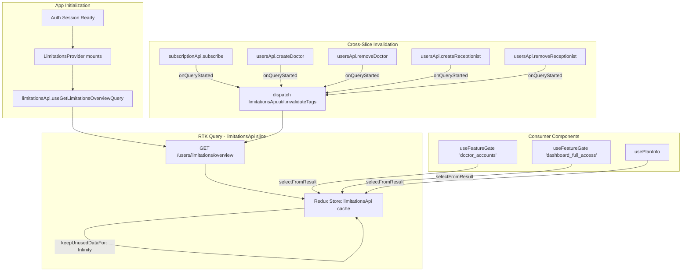

# Design Document: Plan Limitations Integration

## Overview

This feature integrates the backend plan limitations API into the MediSetu frontend, enabling the UI to gate features based on the clinic's current subscription plan. The system fetches limitation data once at app startup via RTK Query, caches it indefinitely, and exposes a `useFeatureGate` hook that components use to determine whether a feature is enabled, disabled, or has reached its usage limit.

The architecture prioritizes:
- **Minimal network overhead**: single fetch at startup, refetch only on limit-relevant events
- **Render performance**: selector-based subscriptions ensure only affected components re-render
- **Type safety**: a TypeScript union type for feature keys prevents typos at compile time
- **Isolation**: a dedicated RTK Query API slice avoids cache interference with other slices

## Architecture



### Data Flow

1. **Startup**: After authentication, a top-level `<LimitationsProvider>` component triggers the RTK Query fetch.
2. **Caching**: The response is stored in the `limitationsApi` reducer with infinite TTL.
3. **Consumption**: Components call `useFeatureGate(featureKey)` which uses `selectFromResult` to subscribe only to the specific feature limit entry.
4. **Invalidation**: When mutations in other API slices (subscription, doctor, receptionist) succeed, their `onQueryStarted` callbacks dispatch `limitationsApi.util.invalidateTags(['Limitations'])` to trigger a refetch.
5. **Refetch**: RTK Query refetches in the background, serving stale data until the new response arrives.

## Components and Interfaces

### 1. `limitationsApi` — RTK Query API Slice

**File**: `src/redux/api/limitationsApi.ts`

```typescript
import { createApi } from "@reduxjs/toolkit/query/react";
import { baseQueryWithAutoLogout } from "./baseQueryWithAutoLogout";
import type { LimitationsOverviewResponse } from "./limitationsApi.types";

export const limitationsApi = createApi({
  reducerPath: "limitationsApi",
  baseQuery: baseQueryWithAutoLogout,
  tagTypes: ["Limitations"],
  keepUnusedDataFor: Number.MAX_SAFE_INTEGER, // persist indefinitely
  endpoints: (builder) => ({
    getLimitationsOverview: builder.query<LimitationsOverviewResponse, void>({
      query: () => ({
        url: "/users/limitations/overview",
        method: "GET",
      }),
      providesTags: ["Limitations"],
    }),
  }),
});

export const { useGetLimitationsOverviewQuery } = limitationsApi;
```

### 2. Type Definitions

**File**: `src/redux/api/limitationsApi.types.ts`

```typescript
/** All known feature keys from the limitations API */
export type FeatureKey =
  | "dashboard_full_access"
  | "doctor_accounts"
  | "lab_integration"
  | "payment_history_months"
  | "pharmacy_integration"
  | "priority_support"
  | "receptionist_accounts"
  | "reports_analytics"
  | "smart_prescriptions"
  | "storage_months"
  | "whatsapp_messages_per_month";

/** A single feature limit entry from the API response */
export interface FeatureLimit {
  featureKey: FeatureKey;
  description: string;
  enabled: boolean;
  limitValue: number | null;
  isUnlimited: boolean;
  currentUsage: number;
  remaining: number | null;
}

/** Plan metadata from the API response */
export interface PlanInfo {
  planId: string;
  planSlug: string;
}

/** Full API response shape */
export interface LimitationsOverviewResponse {
  plan: PlanInfo;
  limits: FeatureLimit[];
}

/** Status derived by the useFeatureGate hook */
export type FeatureStatus = "enabled" | "disabled" | "limit_reached";

/** Return type of the useFeatureGate hook */
export interface FeatureGateResult {
  status: FeatureStatus;
  description: string;
  limitValue: number | null;
  currentUsage: number;
  remaining: number | null;
  isLoading: boolean;
}
```

### 3. `useFeatureGate` Hook

**File**: `src/hooks/useFeatureGate.ts`

```typescript
import { useGetLimitationsOverviewQuery } from "../redux/api/limitationsApi";
import type { FeatureKey, FeatureGateResult, FeatureStatus } from "../redux/api/limitationsApi.types";

/**
 * Derives the feature status from a FeatureLimit entry.
 * Pure function — extracted for testability.
 */
export function deriveFeatureStatus(limit: {
  enabled: boolean;
  remaining: number | null;
  isUnlimited: boolean;
}): FeatureStatus {
  if (!limit.enabled) return "disabled";
  if (limit.isUnlimited) return "enabled";
  if (limit.remaining !== null && limit.remaining <= 0) return "limit_reached";
  return "enabled";
}

/**
 * Hook that gates a feature by its key.
 * Uses selectFromResult for granular re-render subscriptions.
 */
export function useFeatureGate(featureKey: FeatureKey): FeatureGateResult {
  const { featureLimit, isLoading } = useGetLimitationsOverviewQuery(undefined, {
    selectFromResult: ({ data, isLoading }) => ({
      featureLimit: data?.limits.find((l) => l.featureKey === featureKey),
      isLoading,
    }),
  });

  if (isLoading || !featureLimit) {
    return {
      status: "disabled",
      description: "",
      limitValue: null,
      currentUsage: 0,
      remaining: null,
      isLoading,
    };
  }

  return {
    status: deriveFeatureStatus(featureLimit),
    description: featureLimit.description,
    limitValue: featureLimit.limitValue,
    currentUsage: featureLimit.currentUsage,
    remaining: featureLimit.remaining,
    isLoading: false,
  };
}
```

### 4. `usePlanInfo` Hook

**File**: `src/hooks/usePlanInfo.ts`

```typescript
import { useGetLimitationsOverviewQuery } from "../redux/api/limitationsApi";
import type { PlanInfo } from "../redux/api/limitationsApi.types";

/**
 * Hook to access the current plan metadata (planId, planSlug).
 */
export function usePlanInfo(): { plan: PlanInfo | null; isLoading: boolean } {
  const { plan, isLoading } = useGetLimitationsOverviewQuery(undefined, {
    selectFromResult: ({ data, isLoading }) => ({
      plan: data?.plan ?? null,
      isLoading,
    }),
  });

  return { plan, isLoading };
}
```

### 5. `LimitationsProvider` Component

**File**: `src/components/LimitationsProvider.tsx`

```typescript
import { useGetLimitationsOverviewQuery } from "../redux/api/limitationsApi";
import { useAuth } from "../hooks/useAuth";

/**
 * Mounts near the app root (inside auth boundary).
 * Triggers the initial limitations fetch when the user is authenticated.
 * Renders nothing — exists solely to initiate the query subscription.
 */
export function LimitationsProvider({ children }: { children: React.ReactNode }) {
  const { isAuthenticated } = useAuth();

  // Only fetch when authenticated — skip otherwise
  useGetLimitationsOverviewQuery(undefined, { skip: !isAuthenticated });

  return <>{children}</>;
}
```

### 6. Cross-Slice Invalidation Pattern

Mutations in other API slices trigger limitations refetch via `onQueryStarted`:

```typescript
// Example: in subscriptionApi.ts — subscribe mutation
subscribe: b.mutation<{ message: string }, { planId: string }>({
  query: (body) => ({ url: "/users/subscription/subscribe", method: "POST", body }),
  invalidatesTags: ["SubscriptionPlans"],
  async onQueryStarted(_, { dispatch, queryFulfilled }) {
    try {
      await queryFulfilled;
      dispatch(clinicApi.util.invalidateTags(["Clinic"]));
      dispatch(limitationsApi.util.invalidateTags(["Limitations"])); // NEW
    } catch { /* ignore */ }
  },
}),
```

The same pattern applies to:
- `subscriptionApi.verifyRazorpayPayment`
- `subscriptionApi.initialSubscribe`
- Doctor create/remove mutations (in `usersApi` or `accessApi`)
- Receptionist create/remove mutations (in `usersApi` or `accessApi`)

### 7. Store Registration

The `limitationsApi` is added to `apiRoot.ts`:

```typescript
import { limitationsApi } from "./limitationsApi";

export const allApiSlices = [
  // ... existing slices
  limitationsApi,
];
```

This ensures the store's dynamic reducer/middleware registration in `store.ts` picks it up automatically.

## Data Models

### API Response (GET /users/limitations/overview)

```typescript
// Raw API envelope
interface ApiResponse {
  success: boolean;
  data: {
    plan: { planId: string; planSlug: string };
    limits: Array<{
      featureKey: string;
      description: string;
      enabled: boolean;
      limitValue: number | null;
      isUnlimited: boolean;
      currentUsage: number;
      remaining: number | null;
    }>;
  };
}
```

The RTK Query endpoint uses `transformResponse` to unwrap the `data` field:

```typescript
getLimitationsOverview: builder.query<LimitationsOverviewResponse, void>({
  query: () => ({ url: "/users/limitations/overview", method: "GET" }),
  transformResponse: (response: { success: boolean; data: LimitationsOverviewResponse }) =>
    response.data,
  providesTags: ["Limitations"],
}),
```

### Redux State Shape

```
store.getState().limitationsApi = {
  queries: {
    "getLimitationsOverview(undefined)": {
      status: "fulfilled",
      data: {
        plan: { planId: "uuid", planSlug: "Free" },
        limits: [ ...FeatureLimit[] ]
      }
    }
  },
  provided: { Limitations: { ... } },
  ...
}
```

### Status Derivation Truth Table

| `enabled` | `isUnlimited` | `remaining` | → `FeatureStatus` |
|-----------|---------------|-------------|-------------------|
| `false`   | any           | any         | `"disabled"`      |
| `true`    | `true`        | any         | `"enabled"`       |
| `true`    | `false`       | `> 0`       | `"enabled"`       |
| `true`    | `false`       | `0`         | `"limit_reached"` |
| `true`    | `false`       | `null`      | `"enabled"`       |

## Correctness Properties

*A property is a characteristic or behavior that should hold true across all valid executions of a system — essentially, a formal statement about what the system should do. Properties serve as the bridge between human-readable specifications and machine-verifiable correctness guarantees.*

### Property 1: Disabled feature derivation

*For any* `FeatureLimit` object where `enabled` is `false`, regardless of the values of `isUnlimited`, `remaining`, `limitValue`, `currentUsage`, or `description`, the `deriveFeatureStatus` function SHALL return `"disabled"` and the `useFeatureGate` hook SHALL expose the original `description` string unchanged.

**Validates: Requirements 3.1, 3.2**

### Property 2: Limit-reached feature derivation

*For any* `FeatureLimit` object where `enabled` is `true`, `isUnlimited` is `false`, and `remaining` is `0` (or less), the `deriveFeatureStatus` function SHALL return `"limit_reached"`, and the `useFeatureGate` hook SHALL expose the correct `limitValue` and `currentUsage` values from the original object.

**Validates: Requirements 4.1, 4.2**

### Property 3: Enabled feature derivation

*For any* `FeatureLimit` object where `enabled` is `true` AND either `isUnlimited` is `true` OR `remaining` is greater than `0` (or `null`), the `deriveFeatureStatus` function SHALL return `"enabled"`.

**Validates: Requirements 5.1, 5.2**

## Error Handling

| Scenario | Behavior |
|----------|----------|
| **Initial fetch fails (network error / 5xx)** | `useFeatureGate` returns `{ status: 'disabled', isLoading: false }` with empty metadata. Components treat unknown state as restricted (fail-closed). |
| **Refetch fails after successful initial load** | RTK Query retains the previous cached data. Components continue operating with stale-but-valid limits. Error state is available via `isError` on the query. |
| **401 Unauthorized** | Handled by `baseQueryWithAutoLogout` — triggers logout and redirect. Limitations query is skipped when unauthenticated. |
| **Unknown feature key in response** | The `FeatureLimit[]` array may contain keys not in the `FeatureKey` union. The `find()` in `useFeatureGate` simply won't match, returning the loading/disabled fallback. No runtime error. |
| **Feature key not present in response** | Same as above — `find()` returns `undefined`, hook returns disabled fallback. This is intentional fail-closed behavior. |
| **Concurrent invalidation triggers** | RTK Query deduplicates in-flight requests. Multiple rapid invalidations result in a single refetch. |

## Testing Strategy

### Unit Tests (Example-Based)

- **`deriveFeatureStatus` function**: Test each row of the truth table with concrete inputs.
- **`useFeatureGate` hook**: Test with mocked RTK Query state for loading, error, and each status.
- **`usePlanInfo` hook**: Test plan data extraction from mocked state.
- **Cross-slice invalidation**: Verify that mutations dispatch `limitationsApi.util.invalidateTags`.
- **`LimitationsProvider`**: Verify query is skipped when unauthenticated, triggered when authenticated.

### Property-Based Tests

Property-based testing applies to the `deriveFeatureStatus` pure function, which maps `FeatureLimit` inputs to `FeatureStatus` outputs. The input space (combinations of `enabled`, `isUnlimited`, `remaining`) is well-suited to PBT.

**Library**: [fast-check](https://github.com/dubzzz/fast-check) (standard PBT library for TypeScript)

**Configuration**:
- Minimum 100 iterations per property
- Each test tagged with: `Feature: plan-limitations-integration, Property {N}: {description}`

**Properties to implement**:
1. Property 1: Generate random FeatureLimits with `enabled=false`, assert status is always `"disabled"` and description passes through.
2. Property 2: Generate random FeatureLimits with `enabled=true, isUnlimited=false, remaining<=0`, assert status is always `"limit_reached"` and limitValue/currentUsage are preserved.
3. Property 3: Generate random FeatureLimits with `enabled=true` and either `isUnlimited=true` or `remaining>0` or `remaining=null`, assert status is always `"enabled"`.

### Integration Tests

- Verify the full RTK Query lifecycle: fetch → cache → invalidate → refetch.
- Verify `selectFromResult` isolation: changing one feature's data doesn't re-render components subscribed to a different feature.
- Verify `skip` behavior when unauthenticated.

### What Is NOT Property-Tested

- RTK Query caching mechanics (tested by the library itself)
- Network request behavior (integration tests with MSW)
- UI rendering of upgrade prompts (component tests with React Testing Library)
- Cross-slice dispatch wiring (integration tests)
