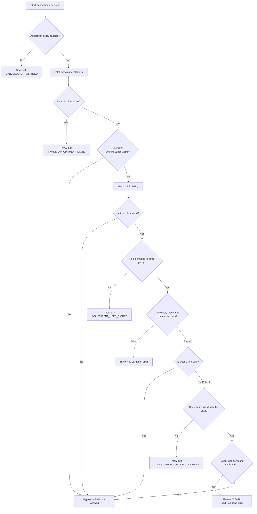
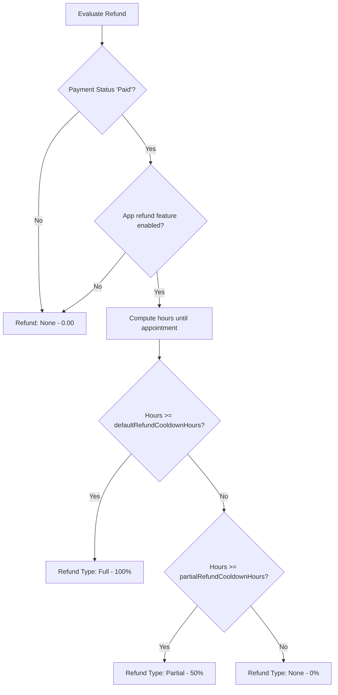

# Cancellation and Refund Policy System: Complete Flow & Architecture Guide

This document provides a comprehensive technical overview of the complete **Cancellation and Refund Policy** system implemented across both the backend (`MediSetu_backend`) and frontend (`InfinityMedisetuWeb_FE`) codebases of the MediSetu platform.

---

## 1. System Architecture & Flow

The Cancellation and Refund Policy System is built on a multi-tiered architecture that balances strict global governance with customizable clinic rules.

```
┌──────────────────────────────────────────────────────────┐
│             Application Governance Policy                │
│       (Global toggles, defaults, refund parameters)       │
└────────────────────────────┬─────────────────────────────┘
                             │ Overrides / Dictates
┌────────────────────────────▼─────────────────────────────┐
│                Clinic-Specific Policy                    │
│   (Role permissions, cancellation windows, limitations,  │
│          reason mandates, rescheduling rules)            │
└────────────────────────────┬─────────────────────────────┘
                             │ Evaluates Against
┌────────────────────────────▼─────────────────────────────┐
│                 Appointment Entity                       │
│    (Tied to a locked policy version at booking time)     │
└──────────────────────────────────────────────────────────┘
```

### 1.1 End-to-End Cancellation Flow

1. **System Checks**:
   - The global cancellation feature flag (`cancellationFeatureEnabled`) is checked. If disabled, a `CANCELLATION_DISABLED` error (HTTP 400) is thrown.
   - The appointment status is inspected. If it resides in a blocked state (`Completed`, `Patient Arrived`, `Cancelled`, `NoShow`, `Rescheduled`, or `Missed`), cancellations are blocked with `INVALID_APPOINTMENT_STATE` (HTTP 400).
2. **Bypass / Overrides**:
   - Requests initiated by `System` or `Super_Admin` bypass all clinic-level policy constraints.
   - Clinic staff roles (`Clinic_Admin`, `Doctor`, `Receptionist`) bypass cancellation window thresholds, patient frequency limitations, and cooldown timers.
3. **Clinic Policy Validation**:
   - The active policy settings configured by the clinic are evaluated.
   - Role-based rights are validated. If the role is disabled (e.g., `allowPatientCancel = false` and user is a patient), an `INSUFFICIENT_USER_RIGHTS` error (HTTP 403) is thrown.
   - Selected reason codes are validated against the master reasons database, and comment character counts are enforced.
4. **Patient Constraints Enforced (Patient-Only)**:
   - **Cancellation Window**: Minimum hours buffer prior to the appointment slot is verified (online vs. offline/in-clinic slots). If violated, a `CANCELLATION_WINDOW_VIOLATION` error (HTTP 400) is thrown.
   - **Cooldown Timer**: The duration since the patient's last cancellation request is validated against `cooldownSecondsBetweenCancellations`. If too recent, a `COOLDOWN_VIOLATION` error (HTTP 429) is thrown.
   - **Frequency Limits**: Daily, weekly, and monthly cancellation counters are verified. Exceeding any of these throws a limit violation error (HTTP 400).



### 1.2 Refund Determination Flow

Refund eligibility and amounts are determined dynamically at the time of cancellation by evaluating the time remaining until the appointment against thresholds set in the global application governance policy.

1. **Payment Status Check**: The engine verifies that the payment status is `'Paid'`. If unpaid, refund eligibility is skipped (`refundType: 'None'`, amount: `0`).
2. **Feature Toggle Check**: The global `refundFeatureEnabled` flag is verified.
3. **Threshold Evaluation**:
   - **Hours Remaining $\ge$ Full Refund Buffer** (`defaultRefundCooldownHours`, e.g., 24h): A **Full Refund** (100% of price) is generated.
   - **Full Refund Buffer $>$ Hours Remaining $\ge$ Partial Refund Buffer** (`partialRefundCooldownHours`, e.g., 12h): A **Partial Refund** (`partialRefundPercentage`, e.g., 50% of price) is generated.
   - **Hours Remaining $<$ Partial Refund Buffer**: No refund is granted (`refundType: 'None'`, amount: `0`).



### 1.3 Asynchronous Payment Gateway Integration

To prevent holding long-running database transaction locks during external API requests, refund processing is split:

1. **Transactional Database Write**:
   - Inside the DB transaction, the appointment status transitions to `'Cancelled'`.
   - A `cancellation_requests` record is inserted with status `'Approved'`.
   - A `cancellation_refunds` log is created. Its state is marked as `'Processing'` for Razorpay online transactions, or `'Pending'` for cash/manual payments.
2. **Out-of-Transaction Razorpay Gateway Call**:
   - If the payment was successful through Razorpay, the engine calls the Razorpay payments refund API with the computed refund amount.
   - **On Gateway Success**: A secondary transaction updates the `cancellation_refunds` log to `'Completed'` and notes the `gatewayRefundId`. It also updates `appointment_payments.paymentStatus` to `'Refunded'`.
   - **On Gateway Failure**: The system catches the error, updates the `cancellation_refunds.refundStatus` to `'Failed'`, records the `failureReason`, and leaves the appointment payment in its current state for administrator review/retry.

---

## 2. Database Schema Specifications

Implemented using **Drizzle ORM** (`src/main/cancellation-policy/models/cancellationPolicy.model.ts`).

### 2.1 Table: `application_cancellation_policies`
Tracks platform-level governance and defaults.
*   `id` (UUID, Primary Key, default random)
*   `cancellationFeatureEnabled` (Boolean, default: `true`)
*   `refundFeatureEnabled` (Boolean, default: `true`)
*   `rescheduleFeatureEnabled` (Boolean, default: `true`)
*   `policyPrecedence` (Varchar, default: `'Application > Clinic'`, length: 50)
*   `allowClinicConfiguration` (Boolean, default: `true`)
*   `defaultRefundPercentage` (Integer, default: `100`)
*   `defaultRefundCooldownHours` (Integer, default: `24`)
*   `partialRefundCooldownHours` (Integer, default: `12`)
*   `partialRefundPercentage` (Integer, default: `50`)
*   `createdAt` & `updatedAt` (Timestamp)

### 2.2 Table: `clinic_cancellation_policies`
Stores customized rules for individual clinics. Implements **Option B versioning** where changing configurations deactivates the current record and inserts a new active version to preserve audit integrity.
*   `id` (UUID, Primary Key, default random)
*   `clinicId` (UUID, References `clinics.id`, cascade delete)
*   `allowPatientCancel` / `allowDoctorCancel` / `allowReceptionistCancel` / `allowClinicAdminCancel` (Boolean, default: `true`)
*   `windowOnlineHours` (Integer, default: `24`): online cancellation buffer hours
*   `windowOfflineHours` (Integer, default: `12`): offline cancellation buffer hours
*   `dailyLimitPerPatient` (Integer, default: `3`)
*   `weeklyLimitPerPatient` (Integer, default: `10`)
*   `monthlyLimitPerPatient` (Integer, default: `30`)
*   `cooldownSecondsBetweenCancellations` (Integer, default: `1800`): Cooldown in seconds
*   `reasonMandatory` (Boolean, default: `true`)
*   `allowAdditionalComments` (Boolean, default: `true`)
*   `minCommentLength` (Integer, default: `0`)
*   `maxCommentLength` (Integer, default: `500`)
*   `allowReschedule` (Boolean, default: `true`)
*   `maxReschedules` (Integer, default: `3`)
*   `rescheduleWindowHours` (Integer, default: `24`)
*   `preservePaymentOnReschedule` (Boolean, default: `true`)
*   `version` (Integer, default: `1`): Monotonically increasing version counter
*   `isActive` (Boolean, default: `true`)
*   `deactivatedAt` (Timestamp)
*   *Partial Constraint*: `ux_clinic_active_policy` unique index on `(clinicId)` where `is_active = true`.

### 2.3 Table: `cancellation_requests`
Audit record of every cancellation attempt and state.
*   `id` (UUID, Primary Key, default random)
*   `appointmentId` (UUID, References `appointments.id`, cascade delete)
*   `clinicId` (UUID, References `clinics.id`)
*   `userId` (UUID, References `users.id`): Performer identifier
*   `userRole` (Varchar, length: 50): Role of the caller (`'Patient'`, `'Doctor'`, etc.)
*   `reasonCode` (Varchar, length: 50): Reason code mapping to static reasons
*   `comments` (Varchar, length: 500, nullable)
*   `isRescheduleRequest` (Boolean, default: `false`)
*   `status` (Varchar, default: `'Approved'`, length: 50)
*   `createdAt` (Timestamp)

### 2.4 Table: `cancellation_refunds`
Dynamic ledger entries tracking individual refund events and gateway integrations.
*   `id` (UUID, Primary Key, default random)
*   `cancellationRequestId` (UUID, References `cancellation_requests.id`, cascade delete)
*   `appointmentId` (UUID, References `appointments.id`, cascade delete)
*   `clinicId` (UUID, References `clinics.id`)
*   `paymentId` (UUID, References `appointment_payments.id`)
*   `refundType` (Varchar, length: 50): `'Full'`, `'Partial'`, `'None'`
*   `originalPrice` (Decimal, 12, 2)
*   `refundAmount` (Decimal, 12, 2)
*   `refundStatus` (Varchar, default: `'Pending'`, length: 50): `'Pending'`, `'Processing'`, `'Completed'`, `'Failed'`
*   `gatewayRefundId` (Varchar, length: 255, nullable): Razorpay refund ID
*   `gatewayResponse` (JSONB, nullable): Razorpay payload trace
*   `failureReason` (Varchar, length: 255, nullable): Catch-block diagnosis trace
*   `createdAt` & `updatedAt` (Timestamp)

### 2.5 Policy Version Locking Mechanism
To prevent clinic configuration changes from retroactively altering the rules of already booked appointments, the schema implements policy version locking:
*   **Column**: `appointments.clinic_cancellation_policy_id` (UUID, References `clinic_cancellation_policies.id`).
*   **Behavior**: When a booking is created, the system copies the active policy ID to the appointment. Future cancellation/refund evaluations lookup this locked policy version rather than the latest configuration.

---

## 3. High Performance Caching Layer

The cancellation module leverages a high-performance **Redis Cache-Aside Layer** (`CancellationCacheService`) to drastically minimize DB lookup frequency:

1.  **Global Platform Policies**: Capped at 24-hour TTL (`GLOBAL_POLICY_TTL`).
2.  **Clinic Active Policies**: Capped at 24-hour TTL (`CLINIC_ACTIVE_POLICY_TTL`).
3.  **Clinic Policy Versions**: Caches immutable historical configurations with a 7-day TTL (`CLINIC_VERSION_POLICY_TTL`). Since historical versions are write-once, they are cached aggressively.
4.  **Invalidation Policy**: Whenever a clinic updates its policy (`updateClinicPolicy` inside `CancellationPolicyService`), it issues a Redis `del` request on the clinic's active key (`cancellation:clinic_policy:active:<clinicId>`), forcing the next check to query the DB and fetch the latest active settings.

---

## 4. Platform Integration & Orchestration Hooks

1.  **BullMQ Auto No-Show Handler**:
    *   During cancellation execution, `autoNoShowQueue.removeAutoNoShow(appointmentId)` is automatically called to remove any pending auto-noshow check tasks from the queues.
2.  **Platform Event Dispatch**:
    *   After a successful cancellation transaction, `AppointmentEngineOrchestrator.onStatusChange()` is fired out-of-band to update statistics and state machine data inside the main booking orchestration system.

---

## 5. API Endpoints Reference

### 5.1 Cancellation System Routes

| Method | Endpoint | Access | Description |
| :--- | :--- | :--- | :--- |
| `GET` | `/api/v1/cancellation-policy/reasons` | Private (Auth) | Retrieves list of cancellation reasons |
| `GET` | `/api/v1/cancellation-policy/default` | Private (Auth) | Retrieves platform default clinic policy settings |
| `GET` | `/api/v1/cancellation-policy/clinic` | Private (Clinic) | Gets the active cancellation policy for the authenticated clinic |
| `PUT` | `/api/v1/cancellation-policy/clinic` | Private (Clinic Admin/Staff) | Updates clinic configuration (deactivates current active policy, creates a new one) |
| `POST` | `/api/v1/cancellation-policy/appointment/:appointmentId/cancel` | Private (Clinic Staff) | Staff-initiated cancellation. Bypasses patient checks |
| `POST` | `/api/v1/patient/appointments/:appointmentId/cancel` | Private (Patient Only) | Patient-initiated cancellation. Enforces window, limits, and cooldowns |

---

## 6. Frontend Configuration & Execution UI

The UI resides in the frontend project (`InfinityMedisetuWeb_FE`) and connects the clinic administrator and staff users to the backend cancellation settings and process flow.

### 6.1 Tab Accessibility & Role-Based Navigation Access
Access to view and edit clinic cancellation rules is restricted on the client side inside [Profile.tsx](file:///d:/InfinityMedisetuWeb_FE/src/pages/profile/Profile.tsx):
*   **Restricted Roles**: The navigation tab is completely hidden from the user interface for roles like `Patient`, `Receptionist`, `Doctor`, and `Pharmacist`.
*   **Authorized Roles**: Only users normalized to the `Admin` role (which represents clinic admins or doctors granted full `isAdminDoctorAccess` rights) are permitted to see and navigate to the `/profile/cancellation-policy` tab route.

### 6.2 Settings Dashboard Implementation Details
*   **Configuration Page**: Implemented in [CancellationPolicySettings.tsx](file:///d:/InfinityMedisetuWeb_FE/src/pages/profile/CancellationPolicySettings.tsx).
*   **State Variables Management**: Tracks all policy fields (e.g. `allowPatientCancel`, `windowOnlineHours`, `cooldownSecondsBetweenCancellations`, etc.) using React states initialized from the API response payload.
*   **Conditional Sub-Sections Rendering**:
    *   **Patient Cancellations**: If `allowPatientCancel` is toggled off, the entire **Cancellation Windows** and **Patient Limitations** sections are disabled visually and functionally using CSS (`opacity-60 pointer-events-none`).
    *   **Comments Input Field**: If `allowAdditionalComments` is toggled off, the input fields for min/max characters count validations are hidden.
    *   **Rescheduling Policy**: The rescheduling configuration cards and checkboxes collapse and hide dynamically when `allowReschedule` is toggled off.
*   **Client-Side Validations**: Enforces the following constraints on save attempts:
    *   Time-windows (Online and In-Clinic notices) cannot be negative.
    *   Cancellation frequency limit numbers (Daily, Weekly, and Monthly limits) cannot be negative.
    *   Cancellation cooldown period value cannot be negative.
    *   If additional comments are enabled, the character boundary lengths cannot be negative, and the minimum character count cannot exceed the maximum character count.
    *   Fires descriptive warning toasts on validation failure using `addToast`.
*   **Unsaved Changes Guard**:
    *   Edits are actively computed against a baseline snapshot (`baselineRef.current`) of the retrieved DB policy.
    *   If current page states differ from the snapshot, `isPageDirty` evaluates to `true`, which flags the dirty state on the platform context via the `useUnsavedChanges()` hook context provider.
    *   The "Save Configuration" button remains disabled until changes are made and successfully validated.

### 6.3 RTK Query API Integration Layer
The data integration uses Redux Toolkit (RTK) Query defined in [cancellationPolicyApi.ts](file:///d:/InfinityMedisetuWeb_FE/src/redux/api/cancellationPolicyApi.ts):
*   **Query Hook `useGetClinicCancellationPolicyQuery`**: Retrieves the active configuration values from `/api/v1/cancellation-policy/clinic`. Subscribes to the `"CancellationPolicy"` state tag.
*   **Mutation Hook `useUpdateClinicCancellationPolicyMutation`**: Triggers a `PUT` update request to `/api/v1/cancellation-policy/clinic`. It automatically invalidates the `"CancellationPolicy"` tag on success, forcing RTK Query to automatically refetch and synchronize the active state values.
*   **Lazy Hook `useLazyGetDefaultCancellationPolicyQuery`**: Fetches the default configuration defaults template. When triggered (by clicking "Reset Defaults"), it overwrites current form states, triggering the unsaved changes state until saved.

### 6.4 Staff-Initiated Cancellation Dialog Flow
When clinic staff initiates a cancellation, the modal handles the flow dynamically:
*   **Modal Component**: Implemented in [CancelAppointmentModal.tsx](file:///d:/InfinityMedisetuWeb_FE/src/pages/appointment/CancelAppointmentModal.tsx), triggered from [AppointmentDetailsModals.tsx](file:///d:/InfinityMedisetuWeb_FE/src/pages/appointment/components/AppointmentDetailsModals.tsx).
*   **Staff Override Banner**: Displays a distinct warning banner reminding the user that as clinic staff, they bypass all patient-facing restrictions (limits, notice windows, and cooldown buffers).
*   **Policy-Driven Validation Forms**:
    *   Fetches valid cancellation reasons from `/api/v1/cancellation-policy/reasons` using `useGetCancellationReasonsQuery` to fill the selector dropdown.
    *   Enforces reason selection dynamically if the clinic's policy defines `reasonMandatory` as true.
    *   Toggles the additional comments text area if `allowAdditionalComments` is true. Enforces minimum and maximum boundaries in real-time, preventing form submission (`Proceed` button stays disabled) if the inputs fail constraint boundaries.
*   **API Response Dispatch**: Executes `useCancelAppointmentStaffMutation`, showing a success alert box displaying the returned payment refund transaction status (e.g. `'Completed'`, `'Processing'`, `'Pending'`, `'Failed'`).

