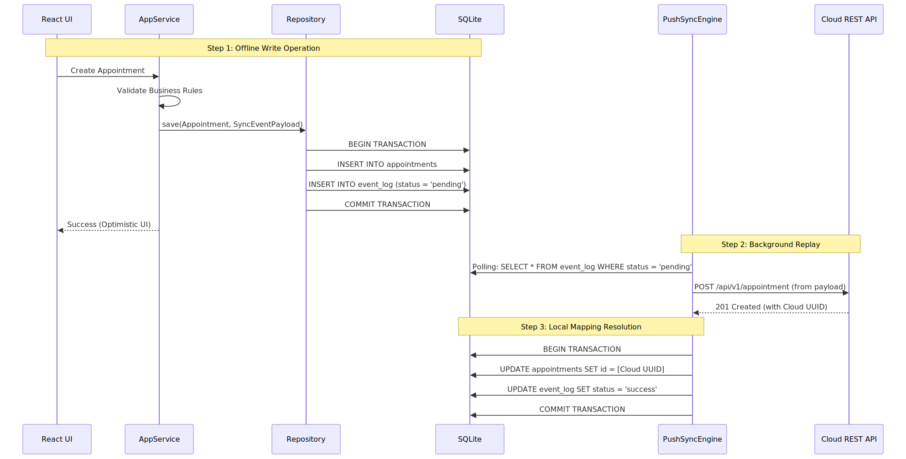

# System Architecture

The Electron application uses a clear boundary between the Frontend (React) and Backend (Node.js/SQLite). 

## High-Level Data Flow

## Component Roles

### 1. TransportLayer Proxy
The `TransportLayer` sits between RTK Query and the network. If running inside Electron, it intercepts network requests and routes them through `window.ipcAPI`. If running on the web, it falls back to standard HTTP `fetch`/`axios` requests. Unported generic REST APIs are intercepted in `baseQueryWithAutoLogout` to prevent `ERR_CONNECTION_REFUSED` when completely offline.

### 2. Preload Script (`window.ipcAPI`)
This is the secure bridge. The React application is entirely sandboxed and cannot directly touch the file system or SQLite. It must pass messages through `window.ipcAPI`.

### 3. Application Services
Files like `PatientAppService.ts` and `AppointmentAppService.ts` house the core business logic. They take raw requests from the IPC handlers, validate them, and instruct the Repositories on what to do. They also create standard `SyncEventPayload` objects for the `event_log`.

### 4. Repositories (Domain-Driven Design)
Files like `SqliteAppointmentRepository.ts` abstract the database completely. The Application Services do not know they are talking to SQLite. The Repository handles the complex SQL queries, JOINs, and executes atomic transactions (e.g. committing a domain object AND the `event_log` entry simultaneously).

## The Push Synchronization Architecture

When a user performs a write operation (Create/Update/Delete) offline, it must eventually be synced back to the Cloud database.

