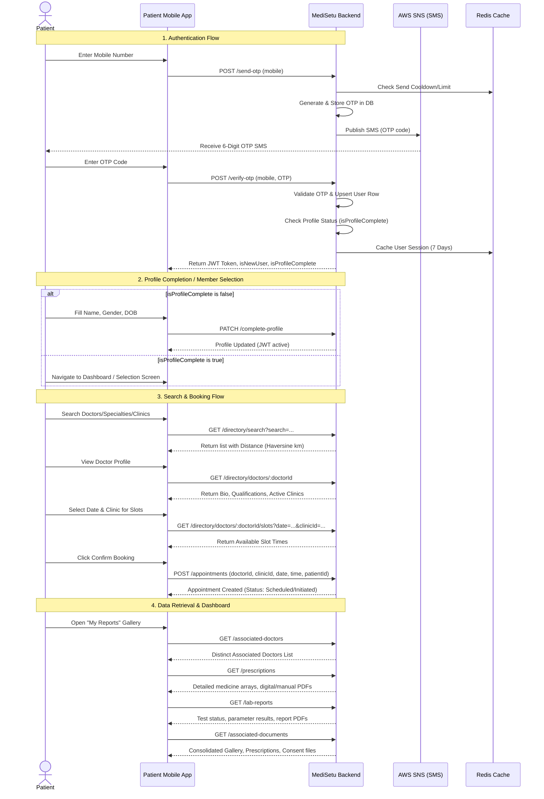

# Patient Flow & API Reference Documentation

This document describes the complete patient lifecycle, flow sequences, and detailed API specifications for the patient-facing module in **MediSetu**.

---

## 1. High-Level Patient Flow Overview

The patient journey follows a streamlined sequence of interactions:



---

## 2. Global Authentication Rules

* **Bearer Token Required:** All private endpoints require the `Authorization` header:
  ```http
  Authorization: Bearer <JWT_TOKEN>
  ```
* **Identity Rule:** One mobile number = One user identity. Patients cannot share a mobile number. Dependents/family members without phone numbers are created with `mobile: NULL` and linked to the primary account.
* **Profile Completeness:** A profile is considered complete once the user has a **Name**, **Gender**, and **Date of Birth** (DOB) recorded.

---

## 3. Detailed API Reference

---

### Phase A: OTP Authentication Flow

#### 1. Send OTP
* **Endpoint:** `POST /api/v1/patient/patient-auth/send-otp`
* **Access:** Public
* **Description:** Generates a 6-digit OTP code, stores the hash in the database, and sends it to the user's mobile number via AWS SNS.
* **Rate Limits:** Max 5 OTP requests per 10-minute window. Enforces a 1-minute cooldown between attempts. In development/testing, OTP is hardcoded to `000000` (AWS SNS is bypassed).
* **Request Body:**
  ```json
  {
    "mobile": "9876543210"
  }
  ```
* **Validation Schema Rules (Zod):**
  * `mobile`: Must be a valid 10-digit Indian mobile number (optionally prefixed with `91` or `+91`).
* **Success Response (200 OK):**
  ```json
  {
    "success": true,
    "message": "OTP sent to your mobile number",
    "data": {
      "expiresInSeconds": 300
    }
  }
  ```

#### 2. Resend OTP
* **Endpoint:** `POST /api/v1/patient/patient-auth/resend-otp`
* **Access:** Public
* **Description:** Requests a fresh OTP for an active verification session.
* **Rate Limits:** Enforces a 1-minute cooldown. Max 5 resends allowed per session.
* **Request Body:**
  ```json
  {
    "mobile": "9876543210"
  }
  ```
* **Success Response (200 OK):**
  ```json
  {
    "success": true,
    "message": "OTP resent successfully",
    "data": {
      "expiresInSeconds": 300,
      "resendCount": 1
    }
  }
  ```

#### 3. Verify OTP
* **Endpoint:** `POST /api/v1/patient/patient-auth/verify-otp`
* **Access:** Public
* **Description:** Verifies the OTP. If correct and the mobile does not exist in the database, a new patient user record and empty profile are created. Returns a JWT token.
* **Request Body:**
  ```json
  {
    "mobile": "9876543210",
    "otp": "000000"
  }
  ```
* **Validation Schema Rules (Zod):**
  * `mobile`: Valid 10-digit Indian number.
  * `otp`: Exactly 6 digits long.
* **Success Response (200 OK):**
  ```json
  {
    "success": true,
    "message": "Login successful",
    "data": {
      "token": "eyJhbGciOiJIUzI1NiIsInR5cCI6IkpXVCJ9...",
      "isNewUser": false,
      "isProfileComplete": true,
      "user": {
        "id": "e22a4fc8-3694-46c5-8461-8152e008fb56",
        "mobile": "9876543210",
        "userType": "Patient",
        "userStatus": "Active"
      }
    }
  }
  ```
  *(Note: If `isProfileComplete` is `false`, the frontend must prompt the user to complete their profile).*

#### 4. Logout
* **Endpoint:** `POST /api/v1/patient/patient-auth/logout`
* **Access:** Private (Patient Bearer Token)
* **Description:** Invalidates the patient's Redis session cache.
* **Success Response (200 OK):**
  ```json
  {
    "success": true,
    "message": "Logged out successfully"
  }
  ```

---

### Phase B: Profile & Account Management

#### 5. Fetch Account & Linked Family Members
* **Endpoint:** `GET /api/v1/patient/account`
* **Access:** Private (Patient Bearer Token)
* **Description:** Fetches the primary profile along with all linked family members/dependents. Called immediately after login to render the profile selector.
* **Success Response (200 OK):**
  ```json
  {
    "success": true,
    "message": "Account fetched successfully",
    "data": {
      "primary": {
        "id": "e22a4fc8-3694-46c5-8461-8152e008fb56",
        "name": "Rahul Kumar",
        "email": null,
        "mobile": "9876543210",
        "userType": "Patient",
        "userStatus": "Active",
        "gender": "Male",
        "alternateMobile": null,
        "city": "Mumbai",
        "state": "Maharashtra",
        "address": "Flat 402, Sea Breeze Apts",
        "zipCode": "400001",
        "profileImage": "https://medisetu-s3.s3.amazonaws.com/profiles/primary.jpg",
        "age": 30,
        "dob": "1996-05-15",
        "bloodGroup": "O+",
        "height": "175 cm",
        "weight": "72 kg",
        "allergies": ["Peanuts"],
        "chronicConditions": [],
        "createdAt": "2026-06-16T10:00:00.000Z",
        "isProfileComplete": true
      },
      "members": [
        {
          "linkId": "b18b4887-f87c-47ea-bd50-c11d2e11804d",
          "relationship": "parent",
          "linkedAt": "2026-06-16T10:05:00.000Z",
          "id": "c1f7b884-bf24-4f01-8bf7-dfd4efc3547f",
          "name": "Sunita Devi",
          "email": null,
          "mobile": null,
          "userType": "Patient",
          "userStatus": "Active",
          "gender": "Female",
          "alternateMobile": null,
          "city": "Mumbai",
          "state": "Maharashtra",
          "address": "Flat 402, Sea Breeze Apts",
          "zipCode": "400001",
          "profileImage": null,
          "age": 65,
          "dob": "1961-09-20",
          "bloodGroup": "B+",
          "height": "155 cm",
          "weight": "60 kg",
          "allergies": [],
          "chronicConditions": ["Hypertension"]
        }
      ]
    }
  }
  ```

#### 6. Fetch Own Profile
* **Endpoint:** `GET /api/v1/patient/my-profile`
* **Access:** Private (Patient Bearer Token)
* **Description:** Returns only the primary user's full profile details.
* **Success Response (200 OK):**
  ```json
  {
    "success": true,
    "message": "Profile fetched successfully",
    "data": {
      "id": "e22a4fc8-3694-46c5-8461-8152e008fb56",
      "name": "Rahul Kumar",
      "email": "rahul@example.com",
      "mobile": "9876543210",
      "userType": "Patient",
      "userStatus": "Active",
      "gender": "Male",
      "alternateMobile": "9876543219",
      "city": "Mumbai",
      "state": "Maharashtra",
      "address": "Flat 402, Sea Breeze Apts",
      "zipCode": "400001",
      "profileImage": "https://medisetu-s3.s3.amazonaws.com/profiles/primary.jpg",
      "age": 30,
      "dob": "1996-05-15",
      "bloodGroup": "O+",
      "height": "175 cm",
      "weight": "72 kg",
      "allergies": ["Peanuts"],
      "chronicConditions": []
    }
  }
  ```

#### 7. Complete Profile
* **Endpoint:** `PATCH /api/v1/patient/complete-profile`
* **Access:** Private (Patient Bearer Token)
* **Description:** Save or update patient details. All fields are optional.
* **Request Body:**
  ```json
  {
    "name": "Rahul Kumar",
    "email": "rahul.kumar@gmail.com",
    "gender": "Male",
    "dob": "1996-05-15",
    "age": 30,
    "city": "Mumbai",
    "state": "Maharashtra",
    "address": "Flat 402, Sea Breeze Apts",
    "zipCode": "400001",
    "bloodGroup": "O+",
    "height": "175",
    "weight": "72",
    "allergies": ["Peanuts"],
    "chronicConditions": []
  }
  ```
* **Validation Schema Rules (Zod):**
  * `email`: String (5-254 chars), must follow standard email regex. Cannot be in use by another user.
  * `gender`: Must be one of `Male`, `Female`, `Other`.
  * `bloodGroup`: Must be one of `A+`, `A-`, `B+`, `B-`, `AB+`, `AB-`, `O+`, `O-`.
  * `age`: Integer between 0 and 150.
* **Success Response (200 OK):**
  *(Returns the complete updated profile object).*

#### 8. Update Profile Image (Own)
* **Endpoint:** `PUT /api/v1/patient/update-profile-image`
* **Access:** Private (Patient Bearer Token)
* **Request Content-Type:** `multipart/form-data`
* **Description:** Uploads a profile image file (JPG, PNG, WebP) to AWS S3 and deletes the old S3 image, if any.
* **Request Payload (Multipart):**
  * File Field: `profileImage`
* **Success Response (200 OK):**
  ```json
  {
    "success": true,
    "message": "Profile image updated successfully",
    "data": {
      "profileImage": "https://medisetu-s3.s3.amazonaws.com/profiles/e22a4fc8-3694-46c5-8461-8152e008fb56.jpg"
    }
  }
  ```

---

### Phase C: Family / Dependent Management

#### 9. Add Family Member
* **Endpoint:** `POST /api/v1/patient/family`
* **Access:** Private (Patient Bearer Token)
* **Description:** Creates a new dependent user record (`mobile: null`) and registers a relationship link in `patient_family_links`.
* **Request Body:**
  ```json
  {
    "name": "Arjun Kumar",
    "relationship": "child",
    "gender": "Male",
    "age": 8,
    "dob": "2018-03-12"
  }
  ```
* **Validation Schema Rules (Zod):**
  * `name`: Required string.
  * `relationship`: Must be one of `spouse`, `child`, `parent`, `sibling`, `other`.
* **Success Response (201 Created):**
  ```json
  {
    "success": true,
    "message": "Family member added successfully",
    "data": {
      "linkId": "fae2e28a-7822-482f-876a-72efb4bf154e",
      "relationship": "child",
      "id": "d1a8c8e1-678c-4f11-bc6a-fae12089b33a",
      "name": "Arjun Kumar",
      "gender": "Male",
      "age": 8,
      "dob": "2018-03-12",
      "alternateMobile": null,
      "city": null,
      "state": null,
      "address": null,
      "zipCode": null,
      "profileImage": null,
      "bloodGroup": null,
      "height": null,
      "weight": null,
      "allergies": null,
      "chronicConditions": null
    }
  }
  ```

#### 10. List Family Members
* **Endpoint:** `GET /api/v1/patient/family?pageNumber=1&pageSize=10`
* **Access:** Private (Patient Bearer Token)
* **Description:** Lists all linked family members with pagination.
* **Success Response (200 OK):**
  ```json
  {
    "success": true,
    "message": "Family members fetched successfully",
    "data": [
      {
        "linkId": "b18b4887-f87c-47ea-bd50-c11d2e11804d",
        "relationship": "parent",
        "linkedAt": "2026-06-16T10:05:00.000Z",
        "id": "c1f7b884-bf24-4f01-8bf7-dfd4efc3547f",
        "name": "Sunita Devi",
        "gender": "Female",
        "age": 65,
        "dob": "1961-09-20",
        "profileImage": null
      }
    ],
    "pagination": {
      "totalRecords": 1,
      "totalPages": 1,
      "pageNumber": 1,
      "pageSize": 10
    }
  }
  ```

#### 11. Get Single Family Member Profile
* **Endpoint:** `GET /api/v1/patient/family/:familyMemberId`
* **Access:** Private (Patient Bearer Token)
* **Description:** Fetches details of a specific family member. Fails if the link does not belong to the primary patient.
* **Request Params:**
  * `familyMemberId`: Valid UUID of the family member.
* **Success Response (200 OK):**
  *(Returns the full profile details with relationship property).*

#### 12. Update Family Member Profile
* **Endpoint:** `PATCH /api/v1/patient/family/:familyMemberId`
* **Access:** Private (Patient Bearer Token)
* **Description:** Updates details of a dependent family member.
* **Restriction:** Not allowed if the family member has their own primary account (i.e. manages their own family links/has mobile registered).
* **Request Body:**
  ```json
  {
    "relationship": "sibling",
    "gender": "Male",
    "age": 28
  }
  ```
* **Success Response (200 OK):**
  *(Returns updated family member profile).*

#### 13. Update Family Member Profile Image
* **Endpoint:** `PUT /api/v1/patient/family/:familyMemberId/update-profile-image`
* **Access:** Private (Patient Bearer Token)
* **Request Content-Type:** `multipart/form-data`
* **Description:** Uploads a profile photo for a linked family member to S3.
* **Request Payload (Multipart):**
  * File Field: `profileImage`
* **Success Response (200 OK):**
  ```json
  {
    "success": true,
    "message": "Family member profile image updated successfully",
    "data": {
      "profileImage": "https://medisetu-s3.s3.amazonaws.com/profiles/family-member-uuid.jpg"
    }
  }
  ```

#### 14. Remove Family Member Link
* **Endpoint:** `DELETE /api/v1/patient/family/:familyMemberId`
* **Access:** Private (Patient Bearer Token)
* **Description:** Removes the link record. If the family member has no mobile login (a pure dependent), their status is marked `Inactive` to prevent orphan DB rows.
* **Success Response (204 No Content):**
  *(No content returned, success headers indicate deletion completed).*

---

### Phase D: Search Directory & Slots

#### 15. Search Doctors / Clinics
* **Endpoint:** `GET /api/v1/patient/directory/search`
* **Access:** Private (Patient Bearer Token)
* **Description:** Searches active clinics and doctors. If latitude and longitude are provided, calculates and filters results by distance using the Haversine formula (km).
* **Query Parameters:**
  * `search` (string, optional) - Match doctor name or clinic name
  * `speciality` (string, optional) - Match doctor specialty
  * `city` (string, optional) - Match clinic city (case-insensitive substring match)
  * `latitude` (number, optional) - Coordinate for proximity search
  * `longitude` (number, optional) - Coordinate for proximity search
  * `radius` (number, optional, default: 10) - Max search radius in km
  * `pageNumber` (string, optional, default: "1")
  * `pageSize` (string, optional, default: "10")
  * `available` (boolean, optional) - If true, filters results to only doctors who are available on the specified `date` (or today)
  * `date` (string, optional, format YYYY-MM-DD) - Date to check availability for the `available` filter and `nextAvailableSlot` lookup
* **Success Response (200 OK):**
  ```json
  {
    "success": true,
    "message": "Directory search completed successfully",
    "data": [
      {
        "doctor": {
          "id": "aa1a8848-bc6c-4f11-9a7b-eef41208a002",
          "name": "Dr. Ramesh Sharma",
          "email": "ramesh@medisetu.com",
          "mobile": "9898989898",
          "gender": "Male",
          "qualification": "MBBS, MD",
          "yearsOfExperience": 12,
          "speciality": "Cardiology",
          "profileImage": "https://medisetu-s3.s3.amazonaws.com/profiles/dr-ramesh.jpg",
          "createdAt": "2026-05-01T08:00:00.000Z"
        },
        "clinic": {
          "id": "e2f7b884-bb24-4f01-8bf7-dfd4efc3522a",
          "clinicName": "HeartCare Clinic",
          "clinicAddress": "123 Main Road, Bandra West",
          "clinicPhone": "0222640001",
          "state": "Maharashtra",
          "city": "Mumbai",
          "zipCode": "400050",
          "clinicLogo": "https://medisetu-s3.s3.amazonaws.com/logos/heartcare.png",
          "latitude": 19.0544,
          "longitude": 72.8402,
          "services": [
            {
              "id": "s1a2e28a-7822-482f-876a-72efb4bf1a8c",
              "clinicId": "e2f7b884-bb24-4f01-8bf7-dfd4efc3522a",
              "serviceName": "General Consultation",
              "price": 500,
              "currency": "INR",
              "additionalServices": "Consultation and checkup",
              "durationDays": null
            }
          ]
        },
        "distance": 1.24,
        "nextAvailableSlot": {
          "date": "2026-06-20",
          "time": "10:00 AM",
          "endTime": "10:30 AM",
          "start": "2026-06-20T10:00:00",
          "end": "2026-06-20T10:30:00",
          "availableTokens": null,
          "totalTokens": null
        }
      }
    ],
    "pagination": {
      "totalRecords": 1,
      "totalPages": 1,
      "pageNumber": 1,
      "pageSize": 10
    }
  }
  ```

#### 16. Get Doctor Public Profile
* **Endpoint:** `GET /api/v1/patient/directory/doctors/:doctorId`
* **Access:** Private (Patient Bearer Token)
* **Description:** Retrieves public bio, degrees, certifications, and active clinic affiliations for a doctor.
* **Success Response (200 OK):**
  ```json
  {
    "success": true,
    "message": "Doctor public profile fetched successfully",
    "data": {
      "id": "aa1a8848-bc6c-4f11-9a7b-eef41208a002",
      "name": "Dr. Ramesh Sharma",
      "gender": "Male",
      "profileImage": "https://medisetu-s3.s3.amazonaws.com/profiles/dr-ramesh.jpg",
      "qualification": "MBBS, MD",
      "yearsOfExperience": 12,
      "speciality": "Cardiology",
      "registrationNumber": "MCI-12345",
      "qualifications": [
        {
          "id": "a1a2e28a-7822-482f-876a-72efb4bf1a8c",
          "userId": "aa1a8848-bc6c-4f11-9a7b-eef41208a002",
          "degree": "MD - Cardiology",
          "college": "KEM Hospital, Mumbai",
          "year": "2014"
        }
      ],
      "clinics": [
        {
          "id": "e2f7b884-bb24-4f01-8bf7-dfd4efc3522a",
          "clinicName": "HeartCare Clinic",
          "clinicAddress": "123 Main Road, Bandra West",
          "clinicPhone": "0222640001",
          "state": "Maharashtra",
          "city": "Mumbai",
          "zipCode": "400050",
          "clinicLogo": "https://medisetu-s3.s3.amazonaws.com/logos/heartcare.png",
          "latitude": 19.0544,
          "longitude": 72.8402,
          "services": [
            {
              "id": "s1a2e28a-7822-482f-876a-72efb4bf1a8c",
              "clinicId": "e2f7b884-bb24-4f01-8bf7-dfd4efc3522a",
              "serviceName": "General Consultation",
              "price": 500,
              "currency": "INR",
              "additionalServices": "Consultation and checkup",
              "durationDays": null
            }
          ]
        }
      ]
    }
  }
  ```

#### 17. Get Doctor Available Slots
* **Endpoint:** `GET /api/v1/patient/directory/doctors/:doctorId/slots`
* **Access:** Private (Patient Bearer Token)
* **Description:** Checks slot availability for a doctor on a specific date at a clinic.
* **Query Parameters:**
  * `date` (string, required) - Formatted as `YYYY-MM-DD`
  * `clinicId` (string, required) - Valid clinic UUID
* **Success Response (200 OK):**
  ```json
  {
    "success": true,
    "message": "Doctor availability slots fetched successfully",
    "data": [
      { "time": "09:00 AM", "available": true },
      { "time": "09:30 AM", "available": false },
      { "time": "10:00 AM", "available": true }
    ]
  }
  ```

#### 18. Toggle Favorite Doctor
* **Endpoint:** `POST /api/v1/patient/directory/doctors/:doctorId/toggle-favorite`
* **Access:** Private (Patient Bearer Token)
* **Description:** Toggles the favorite status of a doctor for the authenticated patient (adds if not already favorited, removes if already favorited).
* **Request Params:**
  * `doctorId` (string, required) - Valid doctor UUID
* **Success Response (200 OK):**
  ```json
  {
    "success": true,
    "message": "Doctor added to favorites successfully",
    "data": {
      "isFavorite": true
    }
  }
  ```

---

### Phase E: Appointment Bookings & Payments

#### 19. Book Appointment
* **Endpoint:** `POST /api/v1/patient/appointments`
* **Access:** Private (Patient Bearer Token)
* **Description:** Books an appointment slot for the patient themselves or for a linked family member.
* **Request Body:**
  ```json
  {
    "doctorId": "aa1a8848-bc6c-4f11-9a7b-eef41208a002",
    "clinicId": "e2f7b884-bb24-4f01-8bf7-dfd4efc3522a",
    "clinicServiceId": "s1a2e28a-7822-482f-876a-72efb4bf1a8c",
    "appointmentDate": "2026-06-20",
    "appointmentTime": "10:00 AM",
    "patientId": "e22a4fc8-3694-46c5-8461-8152e008fb56",
    "notes": "Regular cardiology follow-up",
    "paymentMode": "UPI",
    "price": "500"
  }
  ```
* **Validation Schema Rules (Zod):**
  * `patientId`: Must be either the logged-in user's UUID or an authorized linked family member's UUID.
  * `appointmentDate`: Format `YYYY-MM-DD`.
  * `clinicServiceId`: Required valid clinic service UUID.
* **Success Response (201 Created):**
  ```json
  {
    "success": true,
    "message": "Appointment booked successfully",
    "data": {
      "id": "e3e8c8a1-678c-4f11-bc6a-fae12089b990",
      "patientId": "e22a4fc8-3694-46c5-8461-8152e008fb56",
      "doctorId": "aa1a8848-bc6c-4f11-9a7b-eef41208a002",
      "clinicId": "e2f7b884-bb24-4f01-8bf7-dfd4efc3522a",
      "clinicServiceId": "s1a2e28a-7822-482f-876a-72efb4bf1a8c",
      "appointmentDate": "2026-06-20",
      "appointmentTime": "10:00 AM",
      "tokenNo": 5,
      "appointmentStatus": "Scheduled",
      "price": "500",
      "paymentStatus": "Paid"
    }
  }
  ```

#### 20. Verify Appointment Payment
* **Endpoint:** `POST /api/v1/patient/appointments/verify-payment`
* **Access:** Private (Patient Bearer Token)
* **Description:** Verifies the Razorpay payment signature and confirms the booked appointment.
* **Request Body:**
  ```json
  {
    "appointmentId": "e3e8c8a1-678c-4f11-bc6a-fae12089b990",
    "orderId": "order_abc123",
    "paymentId": "pay_xyz456",
    "signature": "sig_789ghi"
  }
  ```
* **Validation Schema Rules (Zod):**
  * `appointmentId`: Valid UUID of the appointment.
  * `orderId`: Non-empty string.
  * `paymentId`: Non-empty string.
  * `signature`: Non-empty string.
* **Success Response (200 OK):**
  ```json
  {
    "success": true,
    "message": "Payment verified and appointment confirmed successfully"
  }
  ```

#### 21. Razorpay Appointment Webhook
* **Endpoint:** `POST /api/v1/patient/appointments/webhook`
* **Access:** Public (Razorpay Webhook Signature Verification)
* **Description:** Asynchronously captures payment confirmation or payment failure events from Razorpay for patient appointments.
* **Headers:**
  * `x-razorpay-signature`: Valid HMAC HEX signature
* **Request Body:** Raw JSON event payload from Razorpay.
* **Success Response (200 OK):**
  ```json
  {
    "received": true
  }
  ```

#### 22. List All Associated Appointments
* **Endpoint:** `GET /api/v1/patient/appointments?pageNumber=1&pageSize=10&appointmentStatus=Pending,Completed&startDate=2026-06-01&endDate=2026-06-30`
* **Access:** Private (Patient Bearer Token)
* **Description:** Retrieves all past and upcoming appointments for the logged-in patient and their family members.
* **Query Params:**
  * `pageNumber` (optional, default: `1`): Page number.
  * `pageSize` (optional, default: `10`): Number of items per page.
  * `appointmentStatus` (optional): Filter appointments by status. Can be a single status, multiple query parameters (e.g. `?appointmentStatus=Pending&appointmentStatus=Completed`), or a comma-separated list (e.g. `?appointmentStatus=Pending,Completed`). Permitted values: `'Upcoming'`, `'Completed'`, `'Cancelled'`, `'Rescheduled'`, `'Pending'`, `'Missed'`, `'Confirmed'`, `'Patient Arrived'`, `'NoShow'`.
  * `startDate` (optional): Start date of range in `YYYY-MM-DD` format (inclusive).
  * `endDate` (optional): End date of range in `YYYY-MM-DD` format (inclusive).
  * `upcomingOnly` (optional, boolean string): If set to `true`, filters out past appointments (for today, only appointments scheduled after the current hour/minute are shown).
* **Success Response (200 OK):**
  ```json
  {
    "success": true,
    "message": "Patient appointments fetched successfully",
    "data": [
      {
        "id": "e3e8c8a1-678c-4f11-bc6a-fae12089b990",
        "appointmentType": "Consultation",
        "appointmentDate": "2026-06-20",
        "appointmentTime": "10:00 AM",
        "tokenNo": 5,
        "appointmentStatus": "Scheduled",
        "createdAt": "2026-06-16T10:10:00.000Z",
        "patient": {
          "id": "e22a4fc8-3694-46c5-8461-8152e008fb56",
          "name": "Rahul Kumar",
          "mobile": "9876543210",
          "relationship": "self"
        },
        "doctor": {
          "id": "aa1a8848-bc6c-4f11-9a7b-eef41208a002",
          "name": "Dr. Ramesh Sharma",
          "speciality": "Cardiologist",
          "profileImage": "https://example.com/profiles/dr-ramesh.jpg"
        },
        "clinic": {
          "id": "e2f7b884-bb24-4f01-8bf7-dfd4efc3522a",
          "clinicName": "HeartCare Clinic",
          "clinicAddress": "123 Main Road, Bandra West"
        }
      }
    ],
    "pagination": {
      "totalRecords": 1,
      "totalPages": 1,
      "pageNumber": 1,
      "pageSize": 10
    }
  }
  ```

#### 23. List Appointments for Specific Patient
* **Endpoint:** `GET /api/v1/patient/appointments/:patientId?pageNumber=1&pageSize=10&appointmentStatus=Pending,Completed&startDate=2026-06-01&endDate=2026-06-30`
* **Access:** Private (Patient Bearer Token)
* **Description:** Filters and lists appointments belonging only to a specific family member (or self).
* **Request Params:**
  * `patientId`: Valid UUID of self or family member.
* **Query Params:**
  * `pageNumber` (optional, default: `1`): Page number.
  * `pageSize` (optional, default: `10`): Number of items per page.
  * `appointmentStatus` (optional): Filter appointments by status. Can be a single status, multiple query parameters, or a comma-separated list. Permitted values: `'Upcoming'`, `'Completed'`, `'Cancelled'`, `'Rescheduled'`, `'Pending'`, `'Missed'`, `'Confirmed'`, `'Patient Arrived'`, `'NoShow'`.
  * `startDate` (optional): Start date of range in `YYYY-MM-DD` format (inclusive).
  * `endDate` (optional): End date of range in `YYYY-MM-DD` format (inclusive).
  * `upcomingOnly` (optional, boolean string): If set to `true`, filters out past appointments (for today, only appointments scheduled after the current hour/minute are shown).
* **Success Response (200 OK):** Same structure as general appointment list.

#### 24. Get Appointment Detail
* **Endpoint:** `GET /api/v1/patient/appointments/detail/:appointmentId`
* **Access:** Private (Patient Bearer Token)
* **Description:** Fetches detailed records of an appointment, including clinical data, diagnoses, and prescriptions.
* **Success Response (200 OK):**
  ```json
  {
    "success": true,
    "message": "Appointment details fetched successfully",
    "data": {
      "id": "patient-uuid",
      "name": "Patient Name",
      "email": "patient@example.com",
      "mobile": "9876543210",
      "appointment": {
        "id": "appointment-uuid",
        "appointmentDate": "2026-06-20T00:00:00.000Z",
        "appointmentStatus": "Completed"
        // ... other core appointment fields
      },
      "review": {
        "id": "review-uuid",
        "rating": 5,
        "reviewText": "Excellent service!",
        "replyText": "Thank you for the review!",
        "createdAt": "2026-06-21T10:00:00.000Z"
      } // null if patient hasn't submitted a review for this appointment
    }
  }
  ```

---

### Phase F: Data Retrieval (My Reports / Health Records)

#### 25. Get Associated Doctors
* **Endpoint:** `GET /api/v1/patient/associated-doctors`
* **Access:** Private (Patient Bearer Token)
* **Description:** Returns a distinct list of doctors that have ever consulted the primary patient or any of their linked family members. Used to filter reports by consultant.
* **Success Response (200 OK):**
  ```json
  {
    "success": true,
    "message": "Associated doctors fetched successfully",
    "data": [
      {
        "id": "aa1a8848-bc6c-4f11-9a7b-eef41208a002",
        "name": "Dr. Ramesh Sharma",
        "speciality": "Cardiology",
        "qualification": "MBBS, MD",
        "profileImage": "https://medisetu-s3.s3.amazonaws.com/profiles/dr-ramesh.jpg",
        "clinic": {
          "id": "e2f7b884-bb24-4f01-8bf7-dfd4efc3522a",
          "clinicName": "HeartCare Clinic",
          "clinicAddress": "123 Main Road, Bandra West",
          "clinicPhone": "0222640001",
          "clinicLogo": "https://medisetu-s3.s3.amazonaws.com/logos/heartcare.png"
        }
      }
    ]
  }
  ```

#### 26. Get Lab Reports
* **Endpoint:** `GET /api/v1/patient/lab-reports`
* **Access:** Private (Patient Bearer Token)
* **Description:** Retrieves diagnostic lab test reports with results and PDF download links.
* **Query Parameters:**
  * `patientId` (string, optional) - Filter by self or a family member
  * `status` (string, optional) - `Initiated`, `InProgress`, or `Completed`
  * `pageNumber` (string, default: "1")
  * `pageSize` (string, default: "10")
* **Success Response (200 OK):**
  ```json
  {
    "success": true,
    "message": "Lab reports fetched successfully",
    "data": [
      {
        "id": "f5f5f884-bf24-4f01-8bf7-dfd4efc3555f",
        "uniqueTestId": "LAB-10042",
        "reportStatus": "Completed",
        "paymentStatus": "Paid",
        "price": "1200",
        "reportPdf": "https://medisetu-s3.s3.amazonaws.com/reports/LAB-10042.pdf",
        "workflowStatus": "ReportVerified",
        "sampleStatus": "SampleCollected",
        "createdAt": "2026-06-15T09:00:00.000Z",
        "updatedAt": "2026-06-15T12:00:00.000Z",
        "test": {
          "id": "t1a8c8e1-678c-4f11-bc6a-fae12089b001",
          "name": "Lipid Profile",
          "category": "Biochemistry"
        },
        "appointment": {
          "id": "e3e8c8a1-678c-4f11-bc6a-fae12089b990",
          "appointmentDate": "2026-06-15",
          "appointmentTime": "10:00 AM"
        },
        "doctor": {
          "id": "aa1a8848-bc6c-4f11-9a7b-eef41208a002",
          "name": "Dr. Ramesh Sharma"
        },
        "clinic": {
          "id": "e2f7b884-bb24-4f01-8bf7-dfd4efc3522a",
          "clinicName": "HeartCare Clinic"
        },
        "patient": {
          "id": "e22a4fc8-3694-46c5-8461-8152e008fb56",
          "name": "Rahul Kumar"
        },
        "result": {
          "id": "r1a8c8e1-678c-4f11-bc6a-fae12089b111",
          "status": "Verified",
          "remarks": "Borderline high cholesterol. Adjust diet.",
          "verifiedAt": "2026-06-15T12:00:00.000Z",
          "createdAt": "2026-06-15T11:30:00.000Z",
          "values": [
            {
              "id": "v1a8c8e1-678c-4f11-bc6a-fae12089b222",
              "parameterId": "p-chol",
              "parameterName": "Total Cholesterol",
              "value": "210",
              "unit": "mg/dL",
              "referenceRange": "< 200 mg/dL",
              "flag": "High"
            }
          ]
        }
      }
    ],
    "pagination": {
      "totalRecords": 1,
      "totalPages": 1,
      "pageNumber": 1,
      "pageSize": 10
    }
  }
  ```

#### 27. Get Prescriptions
* **Endpoint:** `GET /api/v1/patient/prescriptions`
* **Access:** Private (Patient Bearer Token)
* **Description:** Retrieves digital and manual prescriptions with medicine tables and PDF files.
* **Query Parameters:**
  * `patientId` (string, optional) - Filter by self or a family member
  * `search` (string, optional) - Match doctor or clinic name
  * `pageNumber` (string, default: "1")
  * `pageSize` (string, default: "10")
* **Success Response (200 OK):**
  ```json
  {
    "success": true,
    "message": "Prescriptions fetched successfully",
    "data": [
      {
        "appointmentId": "e3e8c8a1-678c-4f11-bc6a-fae12089b990",
        "appointmentDate": "2026-06-15",
        "appointmentTime": "10:00 AM",
        "appointmentType": "Consultation",
        "appointmentStatus": "Completed",
        "prescriptionPdf": "https://medisetu-s3.s3.amazonaws.com/prescriptions/RX-10024.pdf",
        "prescriptionType": "digital",
        "createdAt": "2026-06-15T10:30:00.000Z",
        "doctor": {
          "id": "aa1a8848-bc6c-4f11-9a7b-eef41208a002",
          "name": "Dr. Ramesh Sharma",
          "speciality": "Cardiology",
          "qualification": "MBBS, MD",
          "profileImage": "https://medisetu-s3.s3.amazonaws.com/profiles/dr-ramesh.jpg"
        },
        "patient": {
          "id": "e22a4fc8-3694-46c5-8461-8152e008fb56",
          "name": "Rahul Kumar"
        },
        "clinic": {
          "id": "e2f7b884-bb24-4f01-8bf7-dfd4efc3522a",
          "clinicName": "HeartCare Clinic",
          "clinicAddress": "123 Main Road, Bandra West"
        },
        "reportCard": {
          "id": "rc-10024",
          "advice": "Drink plenty of water and avoid fatty food.",
          "finalDiagnosis": "Essential Hypertension",
          "provisionalDiagnosis": null,
          "followUpDate": "2026-07-15"
        },
        "medicines": [
          {
            "id": "med-1",
            "reportCardId": "rc-10024",
            "medicineName": "Telmisartan 40mg",
            "composition": "Telmisartan",
            "strength": "40mg",
            "dosage": "1 tablet",
            "frequency": "Once Daily (Morning)",
            "duration": "30 Days",
            "notes": "Take after breakfast",
            "imageUrl": null,
            "uses": "Blood Pressure control"
          }
        ]
      }
    ],
    "pagination": {
      "totalRecords": 1,
      "totalPages": 1,
      "pageNumber": 1,
      "pageSize": 10
    }
  }
  ```

#### 28. Get Consolidated Associated Documents
* **Endpoint:** `GET /api/v1/patient/associated-documents`
* **Access:** Private (Patient Bearer Token)
* **Description:** Consolidates all health-related attachments (gallery images, manual prescriptions, digital prescription PDFs, consent forms, lab reports) in a single feed.
* **Query Parameters:**
  * `patientId` (string, optional) - Filter by self or a family member
  * `documentType` (string, optional) - One of `gallery`, `manual_prescription`, `consent_file`, `digital_prescription`, `lab_report`
  * `search` (string, optional) - Match doctor/clinic names, filename or notes
  * `pageNumber` (string, default: "1")
  * `pageSize` (string, default: "10")
* **Success Response (200 OK):**
  ```json
  {
    "success": true,
    "message": "Associated documents fetched successfully",
    "data": [
      {
        "id": "gal-1",
        "fileUrl": "https://medisetu-s3.s3.amazonaws.com/gallery/img1.jpg",
        "description": "Previous MRI Scan",
        "createdAt": "2026-06-14T08:00:00.000Z",
        "appointmentId": "e3e8c8a1-678c-4f11-bc6a-fae12089b990",
        "appointmentDate": "2026-06-15",
        "doctor": {
          "id": "aa1a8848-bc6c-4f11-9a7b-eef41208a002",
          "name": "Dr. Ramesh Sharma",
          "speciality": "Cardiology"
        },
        "patient": {
          "id": "e22a4fc8-3694-46c5-8461-8152e008fb56",
          "name": "Rahul Kumar"
        },
        "clinic": {
          "id": "e2f7b884-bb24-4f01-8bf7-dfd4efc3522a",
          "clinicName": "HeartCare Clinic"
        },
        "documentType": "gallery",
        "fileName": "Previous MRI Scan"
      }
    ],
    "pagination": {
      "totalRecords": 1,
      "totalPages": 1,
      "pageNumber": 1,
      "pageSize": 10
    }
  }
  ```

---

### Phase G: Push Notifications & Device Token Management

#### 29. Register Push Device Token
* **Endpoint:** `POST /api/v1/notifications/devices`
* **Access:** Private (Bearer Token)
* **Description:** Saves the push notification registration token (FCM/APNs) for the logged-in user session.
* **Request Body:**
  ```json
  {
    "deviceToken": "fcm_token_xyz_123456789_qwerty",
    "platform": "android"
  }
  ```
* **Validation Schema Rules (Zod):**
  * `deviceToken`: Non-empty string.
  * `platform`: Must be either `ios` or `android`.
* **Success Response (201 Created):**
  ```json
  {
    "success": true,
    "message": "Device registered successfully",
    "data": {
      "id": "d1d8c8e1-678c-4f11-bc6a-fae12089ba88",
      "userId": "e22a4fc8-3694-46c5-8461-8152e008fb56",
      "deviceToken": "fcm_token_xyz_123456789_qwerty",
      "platform": "android",
      "createdAt": "2026-06-16T11:00:00.000Z"
    }
  }
  ```

#### 30. Unregister Push Device Token
* **Endpoint:** `DELETE /api/v1/notifications/devices/:deviceToken`
* **Access:** Private (Bearer Token)
* **Description:** Deletes the device token registration.
* **Success Response (204 No Content):**
  *(No content returned).*

#### 31. Get All Notifications
* **Endpoint:** `GET /api/v1/notifications`
* **Access:** Private (Bearer Token)
* **Description:** Retrieves all notifications (read and unread) for the logged-in patient.
* **Query Parameters:**
  * `limit` (number, optional, default: 50, max: 200)
  * `offset` (number, optional, default: 0)
* **Success Response (200 OK):**
  ```json
  {
    "success": true,
    "message": "Notifications fetched successfully",
    "data": [
      {
        "id": "notif-1",
        "userId": "e22a4fc8-3694-46c5-8461-8152e008fb56",
        "type": "appointment_scheduled",
        "title": "Appointment Confirmed",
        "body": "Your appointment with Dr. Ramesh Sharma has been scheduled for June 20 at 10:00 AM.",
        "read": false,
        "data": {
          "appointmentId": "e3e8c8a1-678c-4f11-bc6a-fae12089b990"
        },
        "metadata": null,
        "createdAt": "2026-06-16T10:10:05.000Z"
      }
    ]
  }
  ```

#### 32. Get Unread Notifications
* **Endpoint:** `GET /api/v1/notifications/unread`
* **Access:** Private (Bearer Token)
* **Description:** Retrieves only unread notifications.
* **Query Parameters:** Same as above (default limit is 100).
* **Success Response (200 OK):**
  *(Returns array of unread notification objects).*

#### 33. Mark Notification as Read
* **Endpoint:** `PUT /api/v1/notifications/read/:notificationId`
* **Access:** Private (Bearer Token)
* **Description:** Marks a specific notification as read. Fails if the notification does not belong to the logged-in user.
* **Success Response (200 OK):**
  ```json
  {
    "success": true,
    "message": "Notification marked as read",
    "data": {
      "id": "notif-1",
      "read": true
    }
  }
  ```

#### 34. Delete Notification
* **Endpoint:** `DELETE /api/v1/notifications/:notificationId`
* **Access:** Private (Bearer Token)
* **Description:** Deletes a specific notification.
* **Success Response (200 OK):**
  ```json
  {
    "success": true,
    "message": "Notification deleted successfully"
  }
  ```

#### 35. Delete All Notifications
* **Endpoint:** `DELETE /api/v1/notifications/all`
* **Access:** Private (Bearer Token)
* **Description:** Purges all notifications for the logged-in user.
* **Success Response (200 OK):**
  ```json
  {
    "success": true,
    "message": "All notifications deleted successfully",
    "data": {
      "deletedCount": 12
    }
  }
  ```

---

### Phase H: Doctor Reviews & Ratings

#### 36. Submit Doctor Review
* **Endpoint:** `POST /api/v1/patient/reviews`
* **Access:** Private (Patient Bearer Token)
* **Description:** Submits a rating and review text for a completed appointment.
* **Request Body:**
  ```json
  {
    "appointmentId": "e3e8c8a1-678c-4f11-bc6a-fae12089b990",
    "doctorId": "aa1a8848-bc6c-4f11-9a7b-eef41208a002",
    "rating": 5,
    "reviewText": "Very caring doctor, highly recommended!"
  }
  ```
* **Validation Schema Rules (Zod):**
  * `appointmentId`: Valid UUID of the completed appointment.
  * `doctorId`: Valid UUID of the doctor.
  * `rating`: Integer from 1 to 5.
  * `reviewText`: Optional string up to 1000 characters.
* **Success Response (200 OK):**
  ```json
  {
    "success": true,
    "message": "Review submitted successfully",
    "result": {
      "id": "review-uuid-12345",
      "patientId": "e22a4fc8-3694-46c5-8461-8152e008fb56",
      "doctorId": "aa1a8848-bc6c-4f11-9a7b-eef41208a002",
      "appointmentId": "e3e8c8a1-678c-4f11-bc6a-fae12089b990",
      "rating": 5,
      "reviewText": "Very caring doctor, highly recommended!",
      "createdAt": "2026-06-21T12:00:00.000Z"
    }
  }
  ```

#### 37. Update Doctor Review
* **Endpoint:** `PUT /api/v1/patient/reviews/:reviewId`
* **Access:** Private (Patient Bearer Token)
* **Description:** Updates the rating or review text for a previously submitted review.
* **Request Params:**
  * `reviewId`: Valid UUID of the review.
* **Request Body:**
  ```json
  {
    "rating": 4,
    "reviewText": "Updated review text..."
  }
  ```
* **Validation Schema Rules (Zod):**
  * `rating`: Optional integer from 1 to 5.
  * `reviewText`: Optional string up to 1000 characters.
* **Success Response (200 OK):**
  ```json
  {
    "success": true,
    "message": "Review updated successfully",
    "result": {
      "id": "review-uuid-12345",
      "rating": 4,
      "reviewText": "Updated review text...",
      "updatedAt": "2026-06-22T09:00:00.000Z"
    }
  }
  ```

#### 38. Delete Doctor Review
* **Endpoint:** `DELETE /api/v1/patient/reviews/:reviewId`
* **Access:** Private (Patient Bearer Token)
* **Description:** Deletes a patient's own submitted review.
* **Request Params:**
  * `reviewId`: Valid UUID of the review.
* **Success Response (200 OK):**
  ```json
  {
    "success": true,
    "message": "Review deleted successfully",
    "result": {
      "id": "review-uuid-12345"
    }
  }
  ```

#### 39. Fetch Doctor Reviews
* **Endpoint:** `GET /api/v1/patient/directory/doctors/:doctorId/reviews`
* **Access:** Private (Patient Bearer Token)
* **Description:** Fetches all public reviews/ratings for a specific doctor (paginated).
* **Request Params:**
  * `doctorId`: Valid UUID of the doctor.
* **Query Parameters:**
  * `pageNumber` (string, default: "1")
  * `pageSize` (string, default: "10")
* **Success Response (200 OK):**
  ```json
  {
    "success": true,
    "message": "Reviews fetched successfully",
    "result": [
      {
        "id": "review-uuid-12345",
        "rating": 5,
        "reviewText": "Very caring doctor, highly recommended!",
        "createdAt": "2026-06-21T12:00:00.000Z",
        "patient": {
          "name": "Rahul Kumar",
          "profileImage": null
        }
      }
    ]
  }
  ```

---

### Phase I: Clinic / Receptionist Patient Management APIs

#### 40. Create Patient Record
* **Endpoint:** `POST /api/v1/patient`
* **Access:** Private (Receptionist/Clinic Token)
* **Description:** Creates a new patient record. Can also link the patient as a dependent family member of an existing primary patient.
* **Request Body:**
  ```json
  {
    "name": "Arjun Kumar",
    "gender": "Male",
    "age": 8,
    "dob": "2018-03-12",
    "city": "Mumbai",
    "state": "Maharashtra",
    "relationship": "child",
    "primaryPatientMobile": "9876543210"
  }
  ```
* **Validation Schema Rules (Zod):**
  * `name`: Required string.
  * `gender`: Required string.
  * `age`: Required number.
  * `city`: Required string.
  * `state`: Required string.
  * `mobile`: Required for independent patients (not linked to any family).
  * `relationship`: Optional enum (`spouse`, `child`, `parent`, `sibling`, `other`).
* **Success Response (201 Created):**
  ```json
  {
    "success": true,
    "message": "Patient created successfully",
    "data": {
      "id": "new-patient-uuid",
      "name": "Arjun Kumar",
      "userType": "Patient",
      "userStatus": "Active"
    }
  }
  ```

#### 41. Update Patient Record
* **Endpoint:** `PUT /api/v1/patient`
* **Access:** Private (Receptionist Token)
* **Description:** Updates an existing patient's details.
* **Request Body:**
  ```json
  {
    "peteintId": "new-patient-uuid",
    "name": "Arjun Kumar Updated",
    "city": "Pune"
  }
  ```
* **Validation Schema Rules (Zod):**
  * `peteintId`: Required patient UUID.
  * All other fields are optional.
* **Success Response (200 OK):**
  ```json
  {
    "success": true,
    "message": "Patient updated successfully"
  }
  ```

#### 42. Get All Patients
* **Endpoint:** `GET /api/v1/patient/all`
* **Access:** Private (Receptionist/Clinic Token)
* **Description:** Retrieves all patient records associated with the clinic, with extensive filtering options (by age, gender, date range, etc.).
* **Query Parameters:**
  * `pageNumber` (string, optional)
  * `pageSize` (string, optional)
  * `searchBy` (string, optional)
  * `minAge` / `maxAge` (string, optional)
  * `startDate` / `endDate` (string, optional)
* **Success Response (200 OK):**
  ```json
  {
    "success": true,
    "message": "Patients fetched successfully",
    "data": [
      {
        "id": "e22a4fc8-3694-46c5-8461-8152e008fb56",
        "name": "Rahul Kumar",
        "mobile": "9876543210",
        "userStatus": "Active"
      }
    ],
    "pagination": {
      "totalRecords": 1,
      "pageNumber": 1,
      "pageSize": 10
    }
  }
  ```

#### 43. Search Patients
* **Endpoint:** `GET /api/v1/patient/search`
* **Access:** Private (Receptionist/Clinic Token)
* **Description:** Quick search for patients by name or mobile number.
* **Query Parameters:**
  * `search` (string, optional)
  * `pageNumber` (string, optional)
  * `pageSize` (string, optional)
* **Success Response (200 OK):**
  ```json
  {
    "success": true,
    "message": "Search completed successfully",
    "data": [
      {
        "id": "e22a4fc8-3694-46c5-8461-8152e008fb56",
        "name": "Rahul Kumar",
        "mobile": "9876543210"
      }
    ]
  }
  ```

#### 44. Check Patient Mobile
* **Endpoint:** `GET /api/v1/patient/check-mobile`
* **Access:** Private (Receptionist/Clinic Token)
* **Description:** Checks if a patient exists with a specific mobile number. Returns basic patient details if found.
* **Query Parameters:**
  * `mobile` (string, required) - 10-digit Indian mobile number
* **Success Response (200 OK):**
  ```json
  {
    "success": true,
    "message": "Mobile check completed",
    "data": {
      "exists": true,
      "patient": {
        "id": "e22a4fc8-3694-46c5-8461-8152e008fb56",
        "name": "Rahul Kumar",
        "mobile": "9876543210"
      }
    }
  }
  ```

#### 45. Get Patient by ID
* **Endpoint:** `GET /api/v1/patient/:peteintId`
* **Access:** Private (Receptionist Token)
* **Description:** Fetches complete patient profile and optionally their family links.
* **Request Params:**
  * `peteintId`: Valid UUID of the patient.
* **Query Parameters:**
  * `familyDetails` (string, optional) - Set to `"true"` to include linked family members.
* **Success Response (200 OK):**
  ```json
  {
    "success": true,
    "message": "Patient details fetched successfully",
    "data": {
      "id": "e22a4fc8-3694-46c5-8461-8152e008fb56",
      "name": "Rahul Kumar",
      "mobile": "9876543210",
      "gender": "Male",
      "age": 30,
      "city": "Mumbai"
    }
  }
  ```

