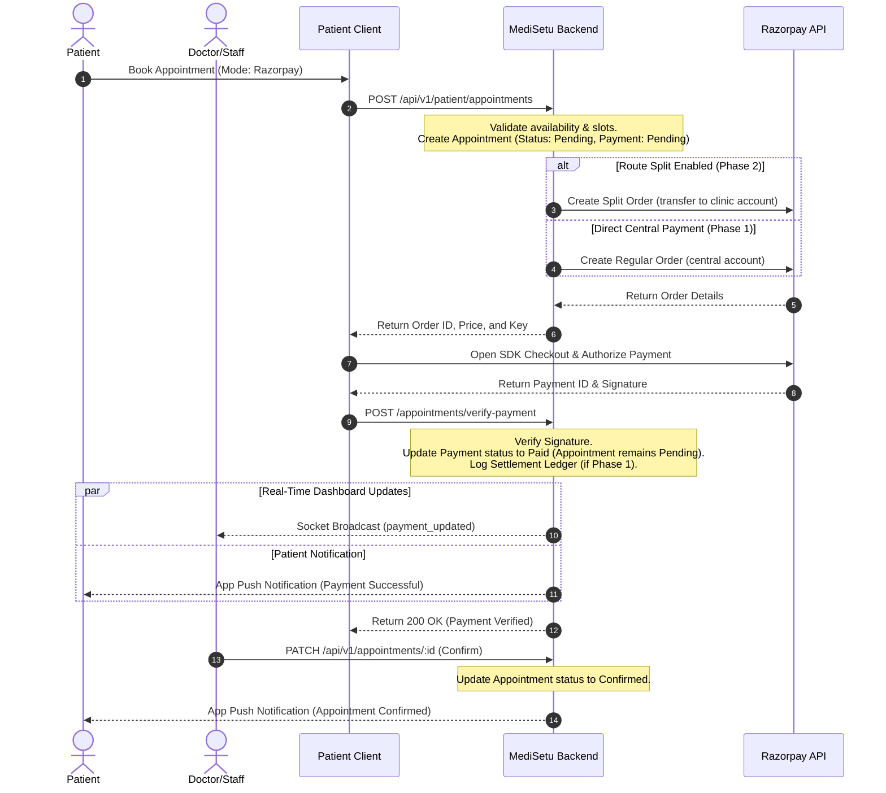

# Razorpay Payment & Appointment Booking Flow Documentation

This document explains the patient appointment booking and Razorpay payment integration lifecycle within the MediSetu backend application.

---

## 1. Flow Configuration (Phase 1 vs Phase 2)

The system supports two payment flows configured via the environment variable `ENABLE_RAZORPAY_ROUTE` (in [envConfig.ts](file:///d:/MediSetu_backend/src/utils/envConfig.ts)):

| Mode | `ENABLE_RAZORPAY_ROUTE` | Flow Type | Description |
| :--- | :--- | :--- | :--- |
| **Phase 1** | `false` | **Direct Platform Payment** | Patients pay to the platform's central Razorpay account. The system logs a pending manual ledger record (`SettlementRecordModel`) for manual offline payouts. |
| **Phase 2** | `true` | **Razorpay Route Split Payment** | Payments are dynamically split at checkout: the clinic's share is transferred to their linked sub-account, and the platform commission is retained centrally. |

> [!IMPORTANT]
> When `ENABLE_RAZORPAY_ROUTE=true`, the clinic **must** have completed Razorpay onboarding and have `routeStatus` as `'ACTIVE'`. If they are not active on Route, the booking fails.
> When `ENABLE_RAZORPAY_ROUTE=false`, bookings can proceed for any clinic without requiring Route setup.

---

## 2. Sequence Diagram

---

## 3. Detailed Step-by-Step Flow

### Step 1: Appointment Booking Request
The patient requests an appointment booking by sending a payload to the backend:
`POST /api/v1/patient/appointments`

1. **Validation**: The backend verifies doctor/patient activity, clinic availability, and double-booking slot availability.
2. **Initial Record Creation**: The appointment is inserted into the database with:
   - `appointmentStatus`: `'Pending'`
   - `paymentStatus`: `'Pending'`
3. **Order Generation**:
   - If `ENABLE_RAZORPAY_ROUTE` is `true` and the clinic is onboarded, it calls `createRazorpaySplitOrder()`.
   - If `ENABLE_RAZORPAY_ROUTE` is `false`, it calls `createRazorpayAppointmentOrder()`.
4. **Response**: Returns the order details to the client. If order creation fails, the database transaction rolls back, deleting the pending slot.

### Step 2: Checkout Processing
The patient's device uses the returned Razorpay order details (`orderId`, `amount`, `keyId`) to trigger the Razorpay payment gateway checkout modal. Once payment is completed, Razorpay returns a `paymentId`, `orderId`, and `signature`.

### Step 3: Verification (API or Webhook)
The patient client sends the verification payload to:
`POST /api/v1/patient/appointments/verify-payment`
*(The payment capture webhook `payment.captured` also processes this in case the user closes the app prematurely).*

1. **Signature Verification**: Validates the payload using the platform's key secret.
2. **Update Database (Paid status)**:
   - **Payment Status**: Updates the appointment payment status to `'Paid'`.
   - **Appointment Status**: Remains `'Pending'` (does not auto-confirm).
3. **Activity Logs**: Registers a `'PAYMENT_STATUS'` action in the history log.
4. **Manual Ledger Log (Phase 1 Only)**:
   If `ENABLE_RAZORPAY_ROUTE` is `false`, the backend inserts a payout ledger row into `SettlementRecordModel` with `payoutStatus: 'pending'`.
5. **Real-time Event Broadcast**:
   Emits a socket event (`'payment_updated'`) to the clinic's room (`clinic:<id>`) so receptionist and doctor dashboards auto-update without needing page reloads.
6. **In-App Push Notification**:
   Sends an app notification (`notifyPaymentReceived`) to the patient confirming payment receipt and advising them that confirmation is pending.

### Step 4: Clinic/Doctor Confirmation
The clinic staff reviews the paid appointment in their dashboard and confirms it:
`PATCH /api/v1/appointments/:appointmentId`

1. **Status Update**: The backend updates the appointment status:
   - `appointmentStatus`: `'Confirmed'`
2. **Confirmation Notifications**:
   Triggers `notifyAppointmentConfirmed()`, which sends the `'Appointment Confirmed'` push notification to the patient.
