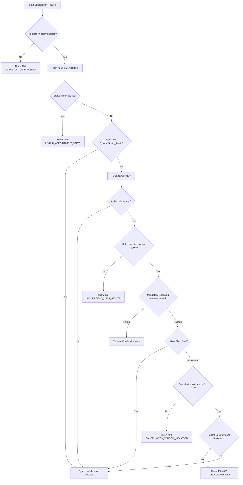
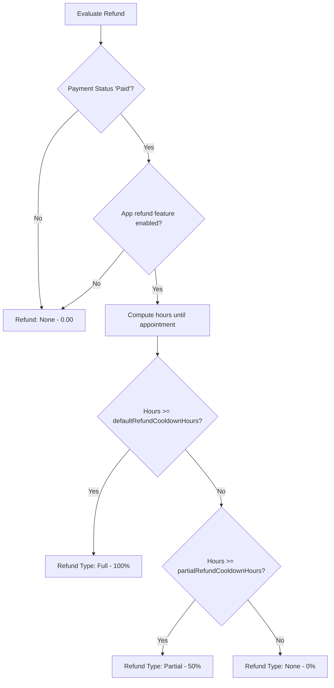

# Cancellation and Refund Policy Implementation (Phase-1)
## Single Source of Truth & Architecture Guide

This document defines the complete technical specifications, flow architectures, database models, database seeding details, and API documentation for **Phase-1** of the Cancellation and Refund Policy implementation in the MediSetu platform.

---

## 1. Flow & Evaluation Engine Architecture

The policy engine operates at two tiers: **Application-level Governance** (global platform rules) and **Clinic-level Policy** (individual clinic preferences). Staff members can bypass rules, while patients are strictly bound by limits and windows.

### 1.1 End-to-End Cancellation Workflow


### 1.2 Refund Flow Workflow


### 1.3 Razorpay Gateway Integration
To maintain high performance and prevent long-lived locks on database tables during external HTTP calls, the gateway payment refund process runs **asynchronously outside the primary database transaction**:
1. **Inside DB Transaction**: The appointment status is updated to `Cancelled`, a `cancellation_requests` entry is recorded, and if eligible, a `cancellation_refunds` log is created in `Processing` (for Razorpay) or `Pending` (for Cash/Manual) status.
2. **Outside DB Transaction**: If the payment mode was `razorpay` and a `transactionId` exists, the external Razorpay API payment refund endpoint is triggered with the calculated refund amount.
   - **On Success**: The database transaction records the gateway response, stores the unique `gatewayRefundId`, updates `cancellation_refunds.refundStatus` to `Completed`, and updates the corresponding `appointment_payments.paymentStatus` to `Refunded`.
   - **On Failure**: The engine catches the exception, updates `cancellation_refunds.refundStatus` to `Failed`, and logs the `failureReason` to allow administrator retry/debugging.

---

## 2. Database Schema Specifications

Drizzle models are defined inside `src/main/cancellation-policy/models/cancellationPolicy.model.ts` and integrated with current system tables.

### 2.1 Table: `application_cancellation_policies`
Governs the platform level overrides and defaults.
- `id` (UUID, Primary Key)
- `cancellationFeatureEnabled` (Boolean, default: `true`): Globally enable/disable cancellations.
- `refundFeatureEnabled` (Boolean, default: `true`): Globally enable/disable payment refunds.
- `rescheduleFeatureEnabled` (Boolean, default: `true`): Globally enable/disable rescheduling.
- `policyPrecedence` (Varchar, default: `'Application > Clinic'`): Governance override settings.
- `allowClinicConfiguration` (Boolean, default: `true`): Permission to allow clinics to customize.
- `defaultRefundPercentage` (Integer, default: `100`): Full refund percentage value.
- `defaultRefundCooldownHours` (Integer, default: `24`): Hours buffer for full refund.
- `partialRefundCooldownHours` (Integer, default: `12`): Hours buffer for partial refund.
- `partialRefundPercentage` (Integer, default: `50`): Partial refund percentage value.
- `createdAt` & `updatedAt` (Timestamp)

### 2.2 Table: `clinic_cancellation_policies`
Clinics store customized rules here. Relies on **Option B simple versioning**: updating a policy marks the old row active status to `false` and creates a new active version row.
- `id` (UUID, Primary Key)
- `clinicId` (UUID, References `clinics.id`): Active clinic relation.
- `allowPatientCancel` (Boolean, default: `true`)
- `allowDoctorCancel` (Boolean, default: `true`)
- `allowReceptionistCancel` (Boolean, default: `true`)
- `allowClinicAdminCancel` (Boolean, default: `true`)
- `windowOnlineHours` (Integer, default: `24`): online cancellation buffer hours.
- `windowOfflineHours` (Integer, default: `12`): offline cancellation buffer hours.
- `dailyLimitPerPatient` (Integer, default: `3`)
- `weeklyLimitPerPatient` (Integer, default: `10`)
- `monthlyLimitPerPatient` (Integer, default: `30`)
- `cooldownSecondsBetweenCancellations` (Integer, default: `1800`): Cooldown in seconds.
- `reasonMandatory` (Boolean, default: `true`): Validate code exists.
- `allowAdditionalComments` (Boolean, default: `true`)
- `minCommentLength` (Integer, default: `0`)
- `maxCommentLength` (Integer, default: `500`)
- `allowReschedule` (Boolean, default: `true`)
- `maxReschedules` (Integer, default: `3`)
- `rescheduleWindowHours` (Integer, default: `24`)
- `preservePaymentOnReschedule` (Boolean, default: `true`)
- `version` (Integer, default: `1`): Incremental policy settings version.
- `isActive` (Boolean, default: `true`): Active status flag.
- `deactivatedAt` (Timestamp)
- **Constraint**: Unique partial index `ux_clinic_active_policy` on `(clinicId)` where `is_active = true` (ensuring exactly one active policy exists per clinic).

### 2.3 Table: `cancellation_requests`
Audit record of every initiated cancellation.
- `id` (UUID, Primary Key)
- `appointmentId` (UUID, References `appointments.id`)
- `clinicId` (UUID, References `clinics.id`)
- `userId` (UUID, References `users.id`): Performer ID.
- `userRole` (Varchar): Role of performer (`'Patient'`, `'Doctor'`, `'Receptionist'`, etc.).
- `reasonCode` (Varchar): Matched cancellation reason code.
- `comments` (Varchar, up to 500 characters)
- `isRescheduleRequest` (Boolean, default: `false`)
- `status` (Varchar, default: `'Approved'`): Cancellation state.

### 2.4 Table: `cancellation_refunds`
Audit and ledger record for payment gateways or ledger tracking.
- `id` (UUID, Primary Key)
- `cancellationRequestId` (UUID, References `cancellation_requests.id`)
- `appointmentId` (UUID, References `appointments.id`)
- `clinicId` (UUID, References `clinics.id`)
- `paymentId` (UUID, References `appointment_payments.id`)
- `refundType` (Varchar): `'Full'`, `'Partial'`, or `'None'`.
- `originalPrice` (Decimal): Appointment transaction fee.
- `refundAmount` (Decimal): Computed refund value.
- `refundStatus` (Varchar, default: `'Pending'`): `'Pending'`, `'Processing'`, `'Completed'`, or `'Failed'`.
- `gatewayRefundId` (Varchar): Gateway specific refund ID.
- `gatewayResponse` (JSONB): API response payload from provider.
- `failureReason` (Varchar): Diagnostic trace on exception.

### 2.5 Table: `cancellation_audits`
Security and configuration log trace.
- `id` (UUID, Primary key)
- `eventType` (Varchar): Event type (`'PolicyUpdate'`, `'StatusChange'`).
- `clinicId` (UUID)
- `userId` (UUID)
- `details` (JSONB): Dynamic audit metadata.

### 2.6 Core Model Schema Changes
A new reference column has been added to the appointments model:
- **`appointments.clinic_cancellation_policy_id`** (UUID, References `clinic_cancellation_policies.id`): Locks the specific active clinic policy version in place at the time the booking is confirmed, ensuring subsequent policy modifications do not retroactively alter the validation of existing bookings.

---

## 3. Database Seeding Specifications

The application-level governance policy relies on seeding to establish a single default record. If this policy settings record is absent in the database, evaluating any cancellation will fail with a `POLICY_NOT_SEEDED` error.

- **Seed File**: `src/drizzle/seeds/cancellationPolicy.seed.ts`
- **Seeder Method**: `seedCancellationPolicy()`
- **Mechanism**: Fetches the first record from `application_cancellation_policies`. If it exists, it updates the record with default configuration settings to prevent duplicate records; otherwise, it inserts a new row.
- **Hook Integration**: The seed handler is imported and invoked inside `main()` in the global seeder entry file `src/drizzle/seed.ts`.

---

## 4. API Endpoints Reference

All endpoints return unified payloads and validate payloads using Zod schemas.

### 4.1 Get Cancellation Reasons Master List
- **Route**: `GET /api/v1/cancellation-policy/reasons`
- **Access**: Private (Authenticated)
- **Response**: Array of reason configurations.
  ```json
  {
    "success": true,
    "message": "Cancellation reasons retrieved successfully",
    "data": [
      {
        "code": "patient_requested",
        "displayName": "Patient Requested",
        "description": "Patient requested cancellation",
        "isActive": true
      },
      ...
    ]
  }
  ```

### 4.2 Get Platform Default Policy
- **Route**: `GET /api/v1/cancellation-policy/default`
- **Access**: Private (Authenticated)
- **Response**: Platform standard defaults for configuring a new clinic policy.

### 4.3 Get Clinic Cancellation Policy
- **Route**: `GET /api/v1/cancellation-policy/clinic`
- **Access**: Private (Clinic Auth)
- **Headers**: Requires active clinic ID authorization context (`req.clinicId`).
- **Response**: The active policy object or `null` if not configured.

### 4.4 Update/Create Clinic Cancellation Policy
- **Route**: `PUT /api/v1/cancellation-policy/clinic`
- **Access**: Private (Clinic Staff: Admin/Receptionist/Doctor)
- **Body Schema**: `updateClinicCancellationPolicySchema`
- **Details**: Creates a new version (incremented version counter) and deactivates the previously active version.

### 4.5 Clinic Staff-Initiated Appointment Cancellation
- **Route**: `POST /api/v1/cancellation-policy/appointment/:appointmentId/cancel`
- **Access**: Private (Clinic Staff)
- **Path Param**: `appointmentId` (UUID)
- **Body Schema**:
  ```json
  {
    "reasonCode": "clinic_closed",
    "comments": "Clinic closed due to severe weather conditions"
  }
  ```
- **Details**: Performs evaluation, bypasses patient restrictions/limits (since it is staff-initiated), updates database status, and coordinates gateway refund execution.

### 4.6 Patient-Initiated Appointment Cancellation
- **Route**: `POST /api/v1/patient/appointments/:appointmentId/cancel`
- **Access**: Private (Patient Only)
- **Path Param**: `appointmentId` (UUID)
- **Body Schema**:
  ```json
  {
    "reasonCode": "patient_requested",
    "comments": "Booking conflict with another appointment"
  }
  ```
- **Details**: Evaluates all patient restrictions (windows, daily/weekly/monthly limits, cooldown timers). Throws error if any rule is violated, or completes the cancellation and triggers refund processing.

---

## 5. Integration Hooks & Orchestration

The cancellation policy module integrates directly into the core appointment booking and updating services:

1. **Appointment Booking**:
   - Inside `AppointmentService.createAppointment`, the active clinic cancellation policy's ID is fetched from the database and saved to the appointment's `clinicCancellationPolicyId` column. This locks the policy version in place.
2. **Generic Appointment Updates**:
   - Inside `AppointmentService.updateAppointment`, if a status transition to `'Cancelled'` is requested (e.g. via direct update APIs), `PolicyEvaluationService.evaluateCancellation` is invoked using the performer's user context to validate the transition eligibility before executing the update.
3. **Queue Cleanup**:
   - During cancellation execution, `autoNoShowQueue.removeAutoNoShow(appointmentId)` is automatically called to remove any pending auto-noshow check tasks from the bullmq queues.
4. **Platform Status Event Dispatch**:
   - After a successful cancellation transaction, `AppointmentEngineOrchestrator.onStatusChange()` is fired out-of-band to update statistics and state machine data inside the main booking orchestration system.
