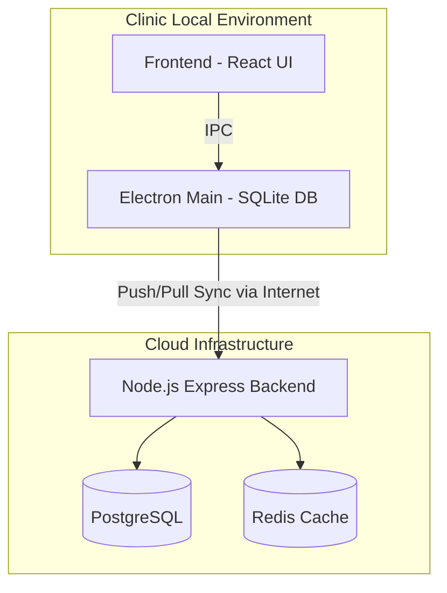
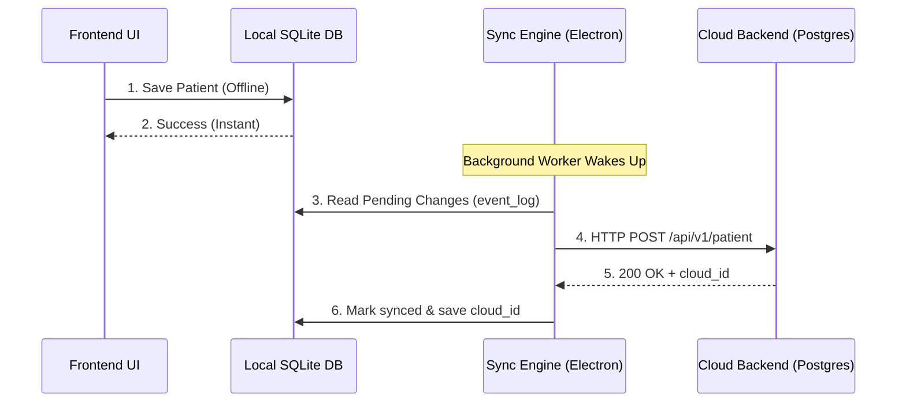

# Medisetu System Architecture & Codebase Documentation

This document provides a comprehensive overview of the Medisetu desktop application and cloud backend, detailing the system architecture, core workflows, technology stack, and codebase structure.

---

## 1. High-Level Architecture Overview

Medisetu is an **Offline-First Hybrid Desktop Application** designed for clinics to manage patients, appointments, and prescriptions seamlessly, even during internet outages.

The architecture consists of three main tiers:

### 1.1 The Presentation Tier (Frontend)
- **Tech Stack**: React 18, Vite, TypeScript, HeroUI (Tailwind CSS), Redux Toolkit.
- **Role**: Renders the user interface, handles client-side form validations, and dispatches data fetching/mutation requests.
- **Location**: `InfinityMedisetuWeb_FE/src/`

### 1.2 The Local Infrastructure Tier (Electron Main Process)
- **Tech Stack**: Electron, Node.js, SQLite, Better-SQLite3.
- **Role**: Acts as a local server for the React frontend. It intercepts API calls via IPC (Inter-Process Communication), stores data in a high-performance local SQLite database, and manages offline-first background workers.
- **Location**: `InfinityMedisetuWeb_FE/electron/`
- **Key Modules**:
  - **Database Manager**: Handles SQLite connections and schema migrations.
  - **Sync Engine**: A background worker that pushes local SQLite changes to the cloud when the internet is restored.
  - **Cluster Network Manager**: Allows multiple computers in the same clinic (on the same local WiFi) to sync with each other without the internet.

### 1.3 The Cloud Tier (Backend)
- **Tech Stack**: Node.js, Express, TypeScript, Drizzle ORM, PostgreSQL, Redis, AWS S3.
- **Role**: The central source of truth. It receives pushed data from clinics, aggregates it, serves patients accessing the web portal, and provides real-time notifications via WebSockets.
- **Location**: `InfinityMedisetu_BE/src/`

---

## 2. Core Workflows Explained

### 2.1 The Offline-First Synchronization Workflow

The application never talks to the Cloud database directly for normal operations. Instead, it reads/writes from the local SQLite database to ensure the app is ultra-fast and works offline. 

**Example: Booking an Appointment**
1. **User Action**: The receptionist books an appointment in the React UI.
2. **IPC Call**: React sends an IPC message `window.ipcAPI.appointments.create(payload)`.
3. **Local Save**: The Electron backend saves the appointment into the **SQLite `appointments` table**. It also logs this action into the `event_log` table (e.g., `ACTION: INSERT, TABLE: appointments`).
4. **Instant UI Response**: The UI instantly updates, showing the appointment as booked.
5. **Background Sync**: The **Sync Engine** (running in the background) notices a new record in `event_log`. 
6. **Cloud Push**: If the internet is connected, the Sync Engine reads the local appointment, reformats it, and sends it to the Cloud API (`POST /api/v1/appointments`).
7. **Cloud Acknowledgment**: The Cloud saves it in PostgreSQL, returns a `cloud_id`, and the Sync Engine updates the local SQLite database to link the local record to the cloud record.

---

## 3. Codebase Structure Guide

### 3.1 Frontend (React)
Located in `InfinityMedisetuWeb_FE/src/`

- `/components`: Reusable UI elements (Buttons, Modals, Cards).
- `/pages`: Full-screen views (Dashboard, Calendar, Patients).
- `/redux`: Global state management.
- `/hooks`: Custom React hooks (e.g., `usePatientData`).
- `/schemas`: Zod validation schemas for forms.

### 3.2 Electron Desktop Shell
Located in `InfinityMedisetuWeb_FE/electron/`

- `/main/index.ts`: The entry point. Bootstraps the app, creates the window, and starts workers.
- `/ipc`: Handlers that listen for messages from the React frontend.
- `/src/main/database`: SQLite connection management and repository patterns.
- `/src/main/sync`: The `SyncEngine.ts` and `PullSyncEngine.ts` that manage internet synchronization.
- `/src/main/cluster`: The TCP/UDP networking logic for local PC-to-PC communication.

### 3.3 Backend (Cloud)
Located in `InfinityMedisetu_BE/src/`

- `/main/users`: Patient and Doctor registration, profiles, authentication.
- `/main/appointments`: Appointment booking, scheduling, and clinical data logic.
- `/main/clinic`: Clinic settings, services, and multi-tenant isolation.
- `/main/pharmacies`: Inventory, stock management, and sales.
- `/middlewear`: Authentication guards, error handlers, and validation.
- `/configurations/dbConnection.ts`: Drizzle ORM and PostgreSQL setup.

---

## 4. Key Terminology

- **IPC (Inter-Process Communication)**: The bridge between the web (React) and the computer system (Electron).
- **Drizzle ORM**: The tool used in the backend to write TypeScript code instead of raw SQL queries.
- **event_log**: A special table in SQLite that acts as a "to-do list" for the Sync Engine. Every time data changes locally, a to-do item is added here to ensure it eventually gets pushed to the cloud.
